20210608

Программа первого вебинарного дня. Теоретический блок и 1 лабораторная работа.

Владислав Цуцков

Для тех, кто хочет запустить eNSP самостоятельно:
- http://www.omavel.in/all/ensp-20v100r003c00/

Версии материалов:
- v1.0
   - ___00_HCIE1.1-R&S_Huawei_Certified_Internetwork_Expert-Routing_and_switching_material-v1.1___ - старая версия. преподаватель часто ссылается на нее, материал рассмотрен подробнее, чем в слайдах ver 3.0
   - ___00_HCIE1.1-R&S+Theory+v1.1.pdf___ - слайды к старой версии

- v3.0
   - ___00_HCIE3.0-R&S+Theory+v3.0.pdf___ - теория - слайды
   - ___00_HCIE3.0-R&S+Theory+v3.0_RUS.pdf___ - теории на русском - слайды
   - ___00_HCIE3.0-R&S+Lab+Guide+v3.0___ - лабгайды v3.0
   - ___00_HCIE3.0-Routing & Switching Lab Guide V3.0_RUS___ - лабгайды v3.0 на русском, искажен шрифт
   - ___00_HCIE3.0-Routing & Switching V3.0 Lab Guide (revised).doc___ - Для отдельных лаб, переработанный материал

Доп. материалы E-Trunk
- https://support.huawei.com/enterprise/en/doc/EDOC1000178168/83eed721/e-trunk
- https://support.huawei.com/enterprise/en/doc/EDOC1000178310/cff339b5/example-for-configuring-connecting-an-e-trunk-to-a-vpls-network
- https://forum.huawei.com/enterprise/ru/hcie-r-s-%D1%83%D1%87%D0%B5%D0%B1%D0%BD%D1%8B%D0%B5-%D0%BC%D0%B0%D1%82%D0%B5%D1%80%D0%B8%D0%B0%D0%BB%D1%8B/thread/689393-100567

Ключевые темы экзамена:
- BGP
- MPLS VPN
- Route Control
- OSPF
- IS-IS (из v 1.1)

___Материал 1-го дня___ 
- Lan Technologies (5-71 / 01:34:00 - 04:37:00)
   - MAC address Table (5-18 / 01:34:00 - 01:56:00)
      - Classification MAC Address Entries (5-9 / 01:34:00 - 01:40:00)
      - Port Security (10-12 / 01:40:00 - 01:44:00)
      - MAC address flapping (13-16 / 01:44:00 - 01:56:00)
      - доп. материал "01_L01+05 Ethernet Switching Security.pdf.pdf"
   - Gratituous (Грэйтиус ЭйЭрПи) ARP (17-18 / 01:56:00 - 01:60:00)
   - MSTP (19-27 / 02:00:00 - 02:25:00)
      - STP/RSTP Review (19-21 / 02:00:00 - 02:05:00)
      - MSTP Fundamentals (22-27 / 02:05:00 - 02:49:00)
      - доп. материал "01_L01+15 MSTP Implementatin and Configuration.pdf" (/ 02:05:00 - 02:25:00)
         - Overview MSTP
         - MST Region
         - MSTI
         - CST
         - IST
         - CIST
         - SST
         - CIST Root, Regional Root, Master Bridge
         - MSTP port Roles
         - MSTP BPDU
         - MSTP Configuration Commands
      - доп. материал "https://habr.com/ru/post/419785"
   - iStack (28-44 / 02:49:00 - 03:28:00; 04:26:00 - 04:30:00)
      - Typical Campus Networking (28-29  / 02:49:00 - 02:56:00)
      - iStack fundamentals (30-44 / 02:56:00 - 02:05:00)
      - доп. материал Configuration Examples iStack "https://support.huawei.com/enterprise/en/doc/EDOC1000047416?section=j00c"
      - доп. материал Configuration Examples iStack "https://support.huawei.com/enterprise/ru/doc/EDOC1000044778/91449095/configuration-examples"
   - CSS (45-56 / 04:30:00 - 04:37:00)
   - Eth-trunk (57-71 / 04:38:00 - 04:37:00) 
      - Eth-trunk Fundam (57-61 / 04:38:00 - 04:54:00)
      - Eth-Trunk Implem (62-67 / 04:38:00 - 04:54:00)
      - E-Trunk (68-71 / 04:54:00 - 04:59:00)
- LAB GUIDE Л/Р 1 (17-28 / 04:59:00 - 05:05:00) 

- WAN Technologies (74-134 / 05:58:00 - 06:40:45)
   - WAN IF (77-77 / 06:00:00 - 06:07:00)
      - Evolution of WAN IF's (78-79 / 06:00:00 - 06:03:00)
      - Ethernet IF's (80-85 / 06:03:00 - 06:04:00)
      - POS IF's (86-87 / 06:04:31 - 06:05:00)
      - Comparision Between Eth and POS IF's (88-90 / 06:05:31 - 06:07:00)
   - Working Mechanism and configuration of PPP (91-123 / 06:07:16 - 06:29:30)
      - Basic PPP (91-97 / 06:07:20 - 06:13:00)
      - LCP (98-106 / 06:13:15 - 06:20:00)
      - PAP Authent (107-109 / 06:21:00 - 06:22:00)
      - CHAP Authent (110-114 / 06:22:00 - 06:24:00)
      - NCP (115-117 / 06:23:45 - 06:26:30)
      - MP Fundamentals (118-119 / 06:26:30 - 06:28:00)
      - PPP and MP Configuration (120-123 / 06:28:10 - 06:29:30)
   - IP-Trunk (124-126 / 06:29:30 - 06:31:21)
   - Working Mechanism and configuration of PPPoE (127-134 / 06:31:25 - 06:40:45)
      - Working Mechanism PPPoE (127-131 / 06:31:25 - 06:37:54)
      - PPPoE Config (132-134 / 06:37:54 - 06:40:45)
- LAB GUIDE Л/Р 2 (29-37 / 06:40:45 - 07:19:12) 

Лабы 1, 2 - сделать до Чтв.

Начал прорабатыватьлекцию, но не успеваю
## MAC address Table (5-18) ##
### Classification MAC Address Entries (5-9) ###
### Port Security (10-12) ###
### MAC address flapping (13-16) ###

## MSTP (стр 19-27) ## 

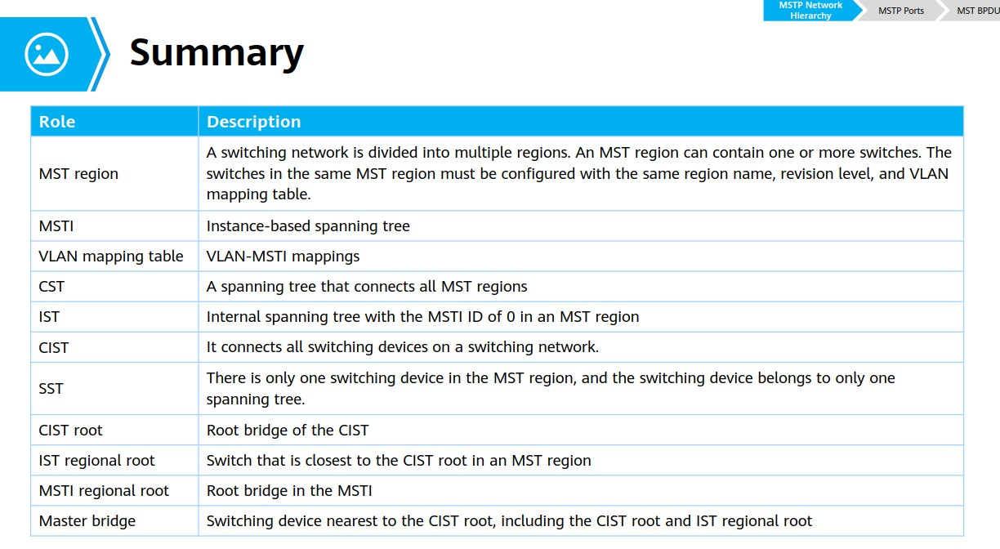

https://habr.com/ru/post/419785/

## iStack/стекирование (стр 28-44)##

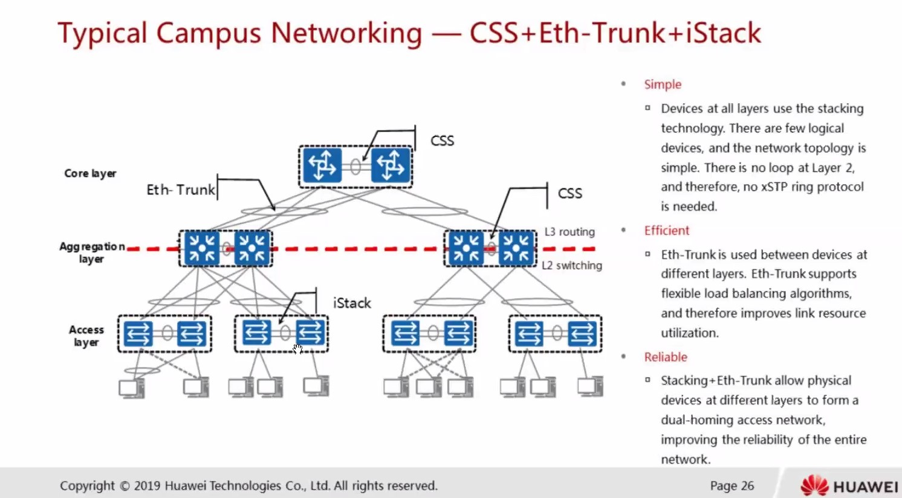
Дает нам:
- синхронизацию Control + Data Plane-ов между физическими коммутаторами
- Используется Multichassis ethertrunk, 
- упрощается STP топология L2

при сборке стека настраивается стек-линк
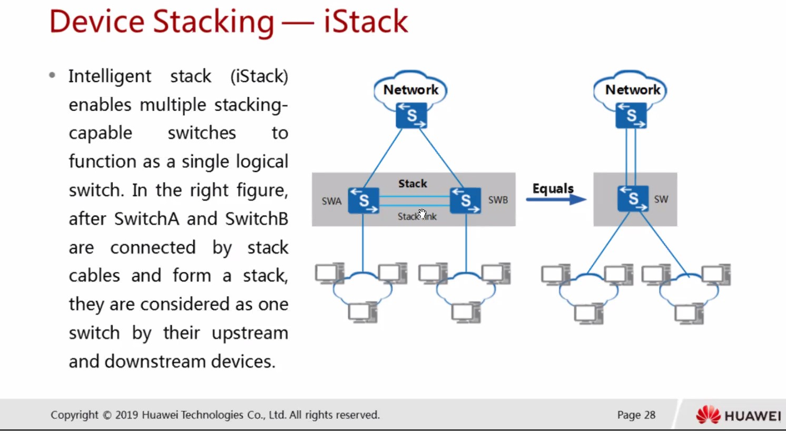
- выбирается мастер, который отвечает за работу коммутаторов в iStack

## Eth-trunk  (стр 57-73) ##
Запись 00:14:00 - xxxx

Прослушали материал, запускаем лабу (Стр. 17-28):

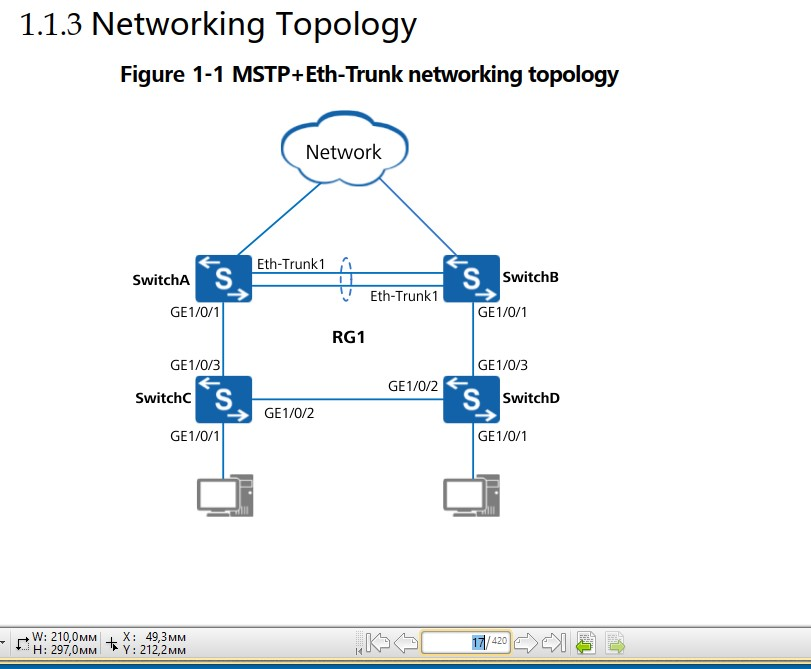

## WAN-Technologies (стр 73-136) ##
### PAP Au 108-109 ###
### CHAP Au 110-114 ###
### NCP 115-117 ###
### MP (Multilink PPP) 118-123 ###

Способ с CHAP
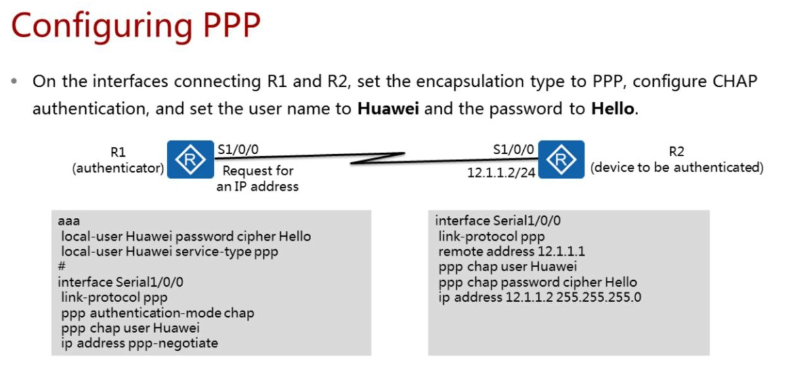
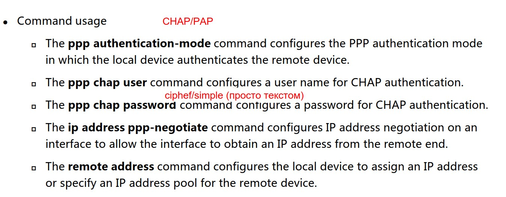

Способ с PAP
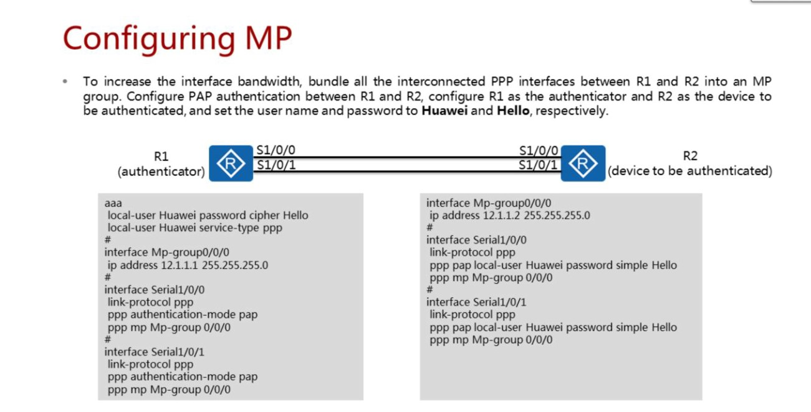

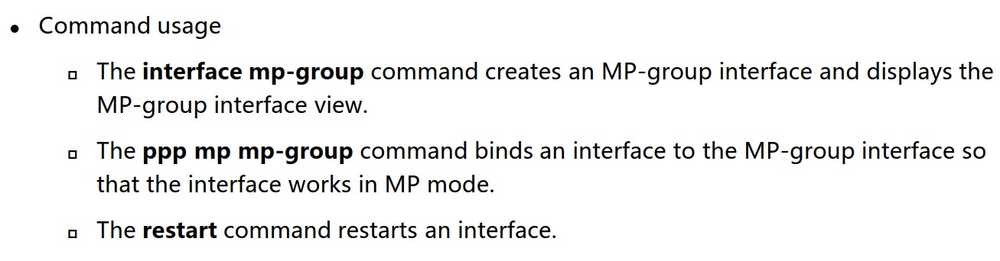

### IP-Trunk 124-126 ###
Trunk interfaces are classified:
- An Eth-Trunk consists of only Ethernet links.
- An IP-Trunk consists of POS interfaces.

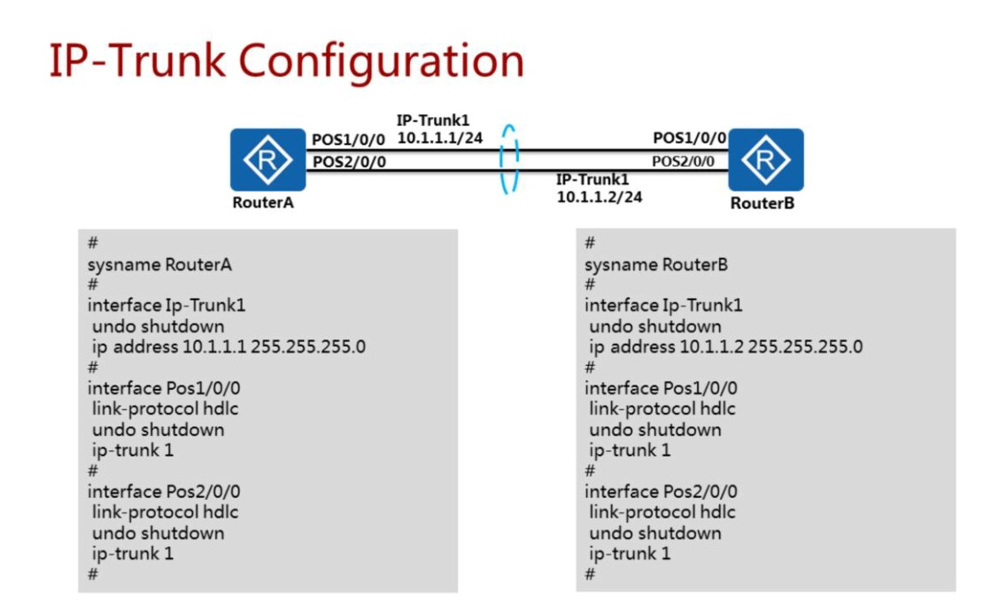

### IP-Trunk 127-136 mas ###
PPP превращает PPP-кадры в ETHERNET-кадры. Для подключения к серверу доступа и последующему выходу в интернет или доступу к ресурсам LAN. At the PPPoE session stage, the PPPoE server and client send all Ethernet data packets in unicast mode. Ресь по-сути идет про обмен информацией с некой базой данных пользователей.

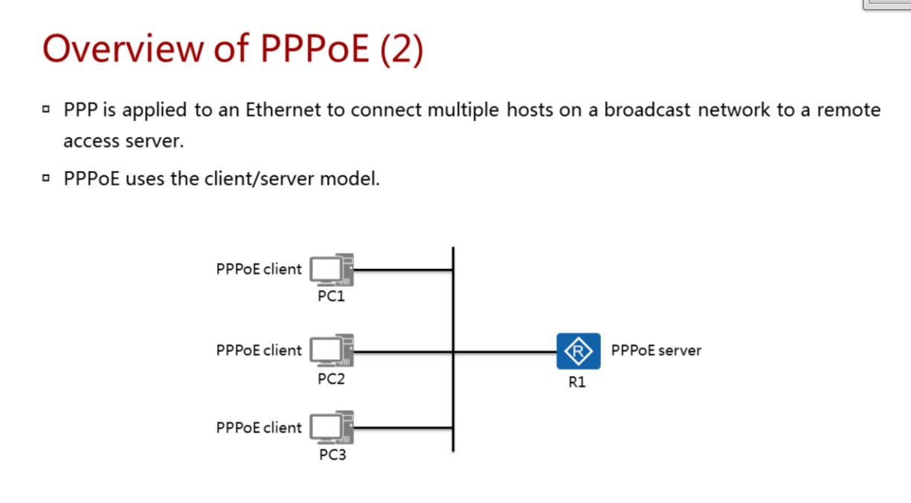

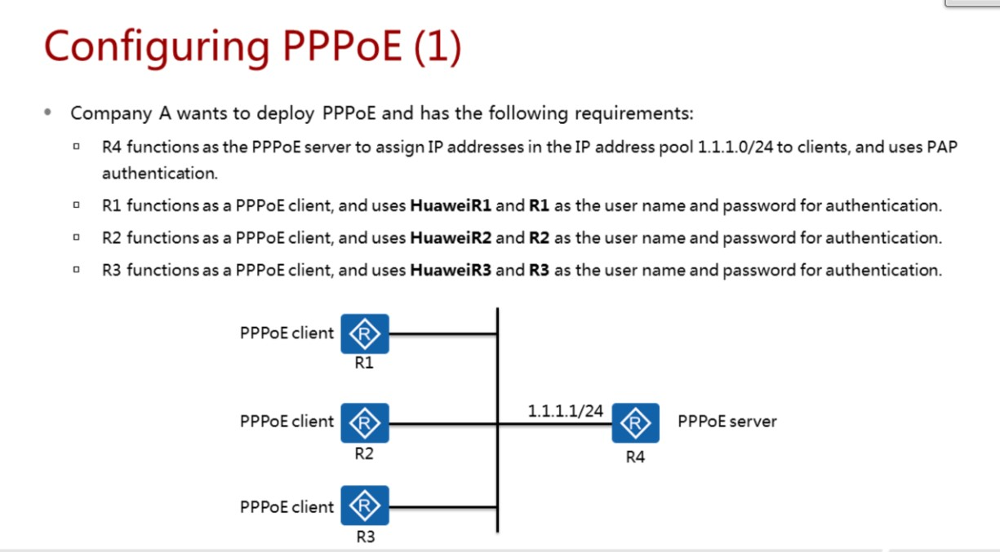

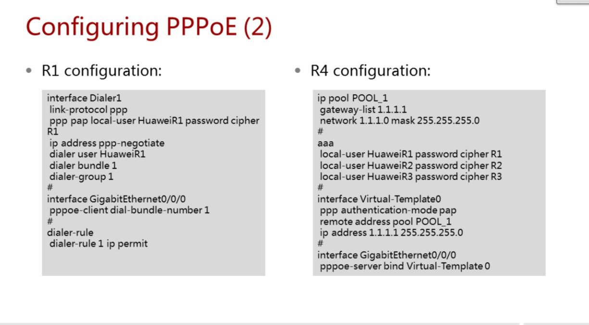

Следующая лекция: IPv6, OSPFv3
Следующая лаба: 3,4,5