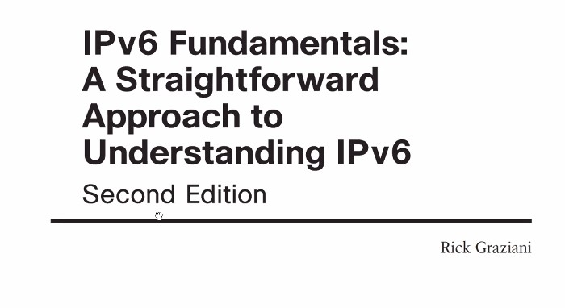
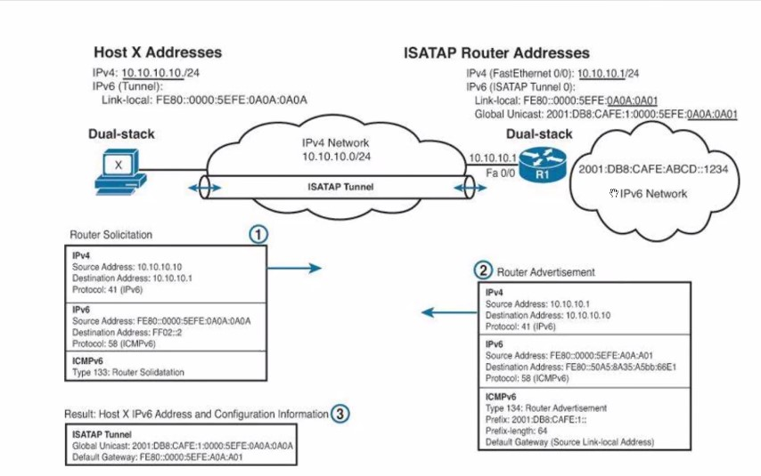
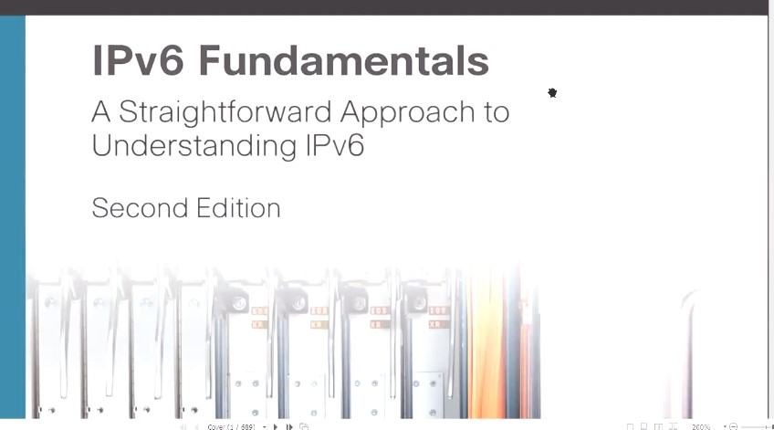
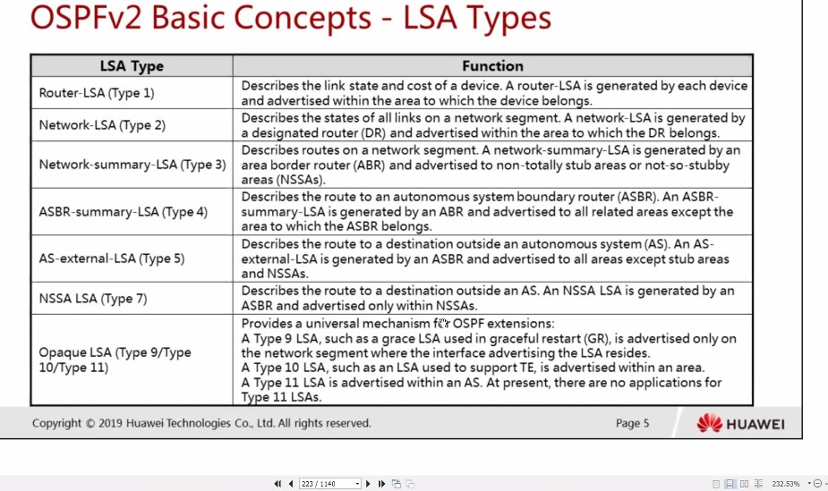
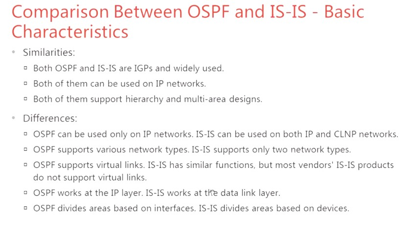

20210610

Программа первого вебинарного дня. Теоретический блок и 3 лабораторных работы

Владислав Цуцков

Версии учебника: 
- ___00_HCIE3.0-R&S+Theory+v3.0.pdf___ - 
- ___00_HCIE3.0-R&S+Theory+v3.0_RUS.pdf___

Лабораторки 
- ___00_HCIE3.0-R&S+Lab+Guide+v3.0___ - положительные отзывы от преподавателя
- ___00_HCIE3.0-Routing & Switching Lab Guide V3.0_RUS___ - на русском, искажен шрифт
- ___00_HCIE3.0-Routing & Switching V3.0 Lab Guide (revised)___ - Для отдельных лаб, переработанный материал
- ___Лабы HCIE-R&S+Theory+v1.1___ - Что-то рассмотрено блее подробно, чем в ver 3.0

Дп. материалы:
- 01_L02+04_IPv6_Fundamentals_A_Straightforward_Approach_to_Understanding_IPv6.pdf
- 01_L02+22_IPv6 Address Configuration.pdf
- 01_L02+20_Introduction to IPv6
- 01_L02+21_ICMPv6 and NDP.pdf

Ключевые темы:
- IPv6 
- Лаба 3, 4, 5 - сделать до Птн.

Добрый день, уважаемые курсанты!
Напоминаем вам, что к нам обратился Тони Старк за помощью, ему необходимо раздобыть координаты камней хроник Акаши. 🌍
Вы можете ему помочь, пройдя квест, где полученные знания 1 блока помогут вам!
✅Квест будет доступен с 11 по 13 июня до 20.00. 

В пятницу, 11 июня вам придёт ссылка в Мираполис, где вы найдёте подробную инструкцию для прохождения.

❗️Если потребуется помощь в подключении или прохождении квеста обращайтесь к @keaful (техподдержка будет доступна все 3 дня с 10.00 до 19.00)

Желаем вам удачи

___Материал 2-го дня___ 
- IPv6 (137-216 / 00:28:00 - 04:54:00)
  - Ipv6 Background (138-144 / 00:28:15 - 00:29:50)
  - Ipv6 Implementation (145-214 / 00:29:51 - 0X:XX:00)
     - Packet Format (145-150 / 00:30:52 - 00:45:00)
     - Address Classification (151-164 / 00:45:00 - 01:13:48)
     - Basic Protocol (165-199 / 01:13:48 - 01:31:00;01:40:00 - 02:35:00)
        - доп. материал "01_L02+21_ICMPv6 and NDP.pdf" (24 - 28)
     - Transition Technologies (200-210 / 02:35:02 - 02:55:15; 04:36:00 - 04:52:00)     
  - Ipv6 Configuration Command (211-214 / 04:52:00 - 04:54:00)
  - Suggestion of Ipv6 Exam prep (215-216 / пролистали)
  - доп. материал "01_L02+04_IPv6_Fundamentals_A_Straightforward_Approach_to_Understanding_IPv6.pdf" (04:57:00 - 04:59:53)
- LAB GUIDE Л/Р 03 (39-48 / 02:55:58 - 02:56:00)      

Перед этим материалом прослушать лекцию 03_L05, чтобы быть в курсе политик/фильтрации

- OSPF (219-294 / 04:60:00 - 07:04:00)
  - OSPFv2 Fundam (222-237 / 05:01:00 - 05:57:00)
     - OSPFv2 Basic Concepts (222-232 / 05:01:00 - 05:50:00)
     - Доп. материал "01_L02+01_Advanced IGP_OSPF_ISIS.pdf" (03-51)
     - Comparision btw OSPFv2, OSPFv3 (233-237 / 05:51:00 - 05:57:00)
  - OSPFv2 Fault Diag (238-240 / 05:57:03 - 06:00:00)
  - OSPFv3 Intro (241-244 / 06:16:00 - 06:20:00)
  - Difference btw OSPFv3 and OSPFv2 (245-281 / 06:20:00 - 07:04:00)
- LAB GUIDE Л/Р 04 (49-60 / 07:04:00 - 07:05:00) 
- LAB GUIDE Л/Р 05  (61-73 / 07:05:00 - 07:06:00): есть ошибка в схеме заготовки, ориентироваться на LAB GUIDE (замечание Владислава 07:07:00)
- Д/З 1 (Z:\HOMEWORK)- (материал в txt / 07:08:00 - 07:28:00), это аналог сертификационной лабы
   - VRRP - самостоятельно, надо знать хорошо, 
   - NAT - также будет в реальной лабе.

## IPv6 137 - 218 ##

Сделать ЛР3

### ISATAP [intrasite automatic tunnel] ###
методички. которая демонстрируется - не нашел. (IPv6 fundamentals). стр 557

А можно еще раз, откуда взялось AAAA в адресе полученном от DNS64?
Ответ 14:31 на записи

## OSPF 219 + третий день ##
Запись 04:57:37 - до конца дня
Заучить нюансы по LSA OSPF v2, v3
### OSPF v2 04:57:37 - 06:01:46 ###
материалы по OSPF - 01 Advanced IGP Features.pdf

Отличие OSPF от IS-IS.

IS-IS единстрвенный работает на канальном уровне, IP-адрес не задействован. Поэтому IS-IS формирует нормальную маршрутизацию для чего угодно:
 - dream fabrik fast (для достижимости свичей) - на канальном уровне
Границы AREA в IS-IS проходят по линкАм. Если 2 роутера в L2 соседстве, то они могут стать соседями в разных AREA

### OSPFv3 introduction 06:01:46 - до конца ###

В HUAWEI - OSPFv3 только для IPv6. 
Автоматом RID не назначается, ___только manual___. Все вормирования соседства только под LLA.

Л/Р 4, 5 - самостоятельно

ЛР4 - не забывать конфигурировать ipv6, ipv6 en на IF
ЛР5 - ориантироваться на LAB Guide, в заготовке - ошибка с AREA.
+

