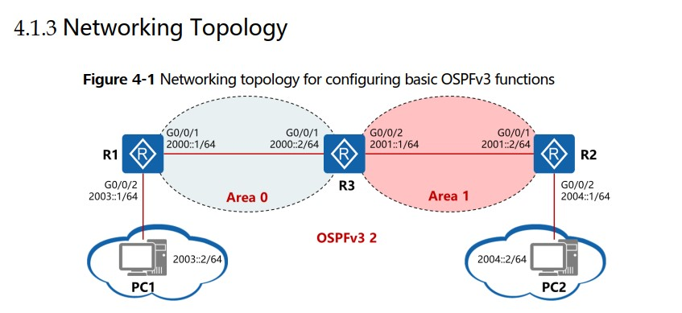

20210608

Оглавление HCIE-R&S+Lab+Guide+v3.0.pdf - стр. 05

Лабораторки 03, 04

___ЛР03___

стр. 39 HCIE-R&S+Lab+Guide+v3.0.pdf

Дизайн, Адресация - на картинках ниже.


## ЗАДАНИЕ ##
1. Настройка IPv4 and IPv6 адресов на физических IF PC1, PC2, R1, R2, Internet. Сконфигурировать IPv4 статические маршруты, чтобы устройства виделись по IPv4. 
2. Настроить IPv6 адреса, IF, и tunnel mode в режиме 6to4 tunnel, сконфигурировать статику IPv6 и запустить 6to4 туннель. 

## Решение ##

Как конфигурить IF на PC - ниже:
- PC1


- PC2


Базовая настройка R1, R2 - одинакова
```
system-view 
sysname R1
ipv6
 
### Настроим сразу IPv4 на outside и IPv6 на Inside
interface GigabitEthernet 0/0/1
ip address 200.1.1.1 24 
quit

interface GigabitEthernet0/0/2
ipv6 enable
ipv6 address 2002:C801:0101::FFFF/64
quit

### 6to4 tunnel
interface Tunnel 0/0/0 
tunnel-protocol ipv6-ipv4 6to4 
ipv6 enable
source 200.1.1.1
ipv6 address auto link-local
quit

### статика во вне IPv4
ip route-static 0.0.0.0 0.0.0.0 200.1.1.2

### статика IPv6 до Inside подсети R2
ipv6 route-static 2002:C802:0202:: 64 Tunnel 0/0/0
```

проверка связности на R - ___ping ipv6___

Конфиги по задаче тут: [R1](config/L3/R1.txt), [R2](config/L3/R2.txt), [R-Internet](config/L3/R-Internet.txt)


___ЛР04___

стр. 49 HCIE-R&S+Lab+Guide+v3.0.pdf

Дизайн, Адресация - на картинках ниже. На стенде заметно отличие: в каждой AREA настроен свой process





## ЗАДАНИЕ ##
1. Настроить IPv6 адреса для PC1, PC2, R1, R2 и R3 так, чтобы напрямую подключенные узлы имели ipv6 связность . 
2. Настроить OSPFv3 на R1, R2 и R3 так чтобы они видели друг друга 
3. Импортировать Direct маршруты в OSPFv3 процессы на R1 и R2, в результате PC1 должен иметь IPv6 связность с PC2. 

## Решение ##

Пример настройки R1. Конфиг практически идентичен с R2
```
system-view 
sysname R1
ipv6
 
### Настроим сразу IPv4 на outside и IPv6 на Inside
interface GigabitEthernet0/0/2
ipv6 enable
ipv6 address 2003::1 64
quit

interface GigabitEthernet 0/0/1
ipv6 enable
ipv6 address 2000::1 64 
quit


### OSPFv3 2
ospfv3 2
router-id 10.10.10.10
quit

### включаем OSPFv3 2 на IF
interface GigabitEthernet0/0/1
ospfv3 2 area 0
quit


### импортируем коннектед маршруты
ospfv3 2
import-route direct
quit
```

Тонкость задачи заключается в настройке импорта маршрутов на R3, в контекстах OSPFv3 2 и OSPFv3 3

```
### импортируем маршруты из ospf второго Process-ID
ospfv3 2
import-route ospfv3 3
quit

ospfv3 3
import-route ospfv3 2
quit
```

Результат работы отражен в таблице маршрутизации R2. Видно. что она содержит маршруты во все необходимые префиксы.


Проверка связности между PC - выполнена успешно

Конфиги по задаче тут: [R1](config/L4/R1.txt), [R2](config/L4/R2.txt), [R3](config/L4/R3.txt)


# Д/З 1 №
Дана подсеть


Задания

1. Configure between SW1 and SW2 Eth-trunk in LACP mode with load balance traffic based on source and destination MAC address. Если LACP - то будут проблемы с отключенным VLAN 1, а если static, то будет работать и без VLAN1

### LSW1, LSW2
```
interface Eth-Trunk 1 
mode lacp
load-balance src-dst-mac
trunkport gigabitethernet 0/0/12 
trunkport gigabitethernet 0/0/13
quit
sysname ####ENTER_NAME###
```

2.Configure the link type of interfaces connecting between all switches to trunk, and configure the interfaces to allow packets of all VLANs except VLANs 1, 100, 200 to pass through.

```
### Все SW
vlan batch 10 11 12 100 200

### Включаем защиту от рута на CORE LSW1, LSW2
int gi 0/0/1
stp root-protection 
quit
int gi 0/0/2
stp root-protection 
quit

### На ACCESS SW LSW3, LSW4
stp bpdu-protection
sysname ####ENTER_NAME###

### Конфигаем Eth-Trunk 1, и все Uplinks
interface Eth-Trunk 1 

port link-type trunk
undo port trunk allow-pass vlan all
port trunk allow-pass vlan all
undo port trunk allow-pass vlan 100
undo port trunk allow-pass vlan 200
undo port trunk allow-pass vlan 1
port trunk pvid vlan 10
quit
```

3.Configure all switches to run MSTP. 

```
stp region-configuration
instance 11 vlan 11
instance 12 vlan 12
active region-configuration 
quit 
```

3.1 Configure the mapping between VLAN 11 and MSTI 11, and configure SW1 as primary root bridge and SW2 as secondary root bridge. 
```
LSW1
stp instance 11 root primary
stp instance 12 root secondary

SW3
interface gigabitethernet 0/0/2
stp instance 11 cost 20000
quit
```
3.2 Configure the mapping between VLAN 12 and MSTI12, and configure SW2 as the primary root bridge and SW1 as secondary root bridge. 
```
LSW2
stp instance 12 root primary
stp instance 11 root secondary

SW4
interface gigabitethernet 0/0/2
stp instance 12 cost 20000
quit
```


3.3 Set the MST region name to LAB, and set the revision level of the MST region to 5.
```
### На всех SW
stp region-configuration
region-name LAB 
revision-level 5
active region-configuration

### Включение на всех SW проприетарщины HUA для расчета pathcost
stp pathcost-standard legacy
```
Иллюстрация того, как здорово все сошлось


4. On all other interfaces except the interconnection interfaces between switches configure edge ports.
```
LSW1, LSW2
port-group test
group-member gi 0/0/3 to GigabitEthernet 0/0/4 GigabitEthernet 0/0/6 to GigabitEthernet 0/0/11 GigabitEthernet 0/0/14 to GigabitEthernet 0/0/24
stp edged-port enable
quit

LSW3, LSW4
port-group test
group-member gi 0/0/4 to GigabitEthernet 0/0/24
stp edged-port enable
quit

interface GigabitEthernet0/0/3
 port link-type access
 port default vlan ### VLAN № ###
```

5.0 Предварительные настройки на RR
```
AR1
sysname AR1
int lo0
ip add	200.1.1.1 32
quit

int gi 0/0/2
ip add	192.168.113.1 24
quit
int gi 0/0/1 
undo shut
int gi 0/0/1.11
dot1q termination vid 11
ip add 192.168.11.101 24
arp broad ena
undo shut
quit

int gi 0/0/1.12
dot1q termination vid 12
ip add 192.168.12.101 24
arp broad ena
undo shut
quit

int gi 0/0/0
ip add	192.168.112.1 24
quit

AR2 - аналогично
AR3 - даже не заслуживает внимания
```
___arp broad ena___ - на сабах была самая большая проблема, из-за нее не работал нормально ping с рабочих станций


5. Configure VRRP group  on R1 and R2 is assigned the virtual IP address 192.168.11.1, and functions as the gateway for PC1. R1 periodically sends gratuitous ARP packets with sender IP address as 192.168.11.1 and source MAC address as 00-00-5E-00-01-0B. The data frames transmitted between PC1 and the gateway are tagged with VLAN 11 (PC sends and receives untagged frames).

```
AR1
int gi 0/0/1.11
vrrp vrid 11 virtual-ip 192.168.11.1      ### ip addr VVRP gr 11 (by MAC)
vrrp vrid 11 priority 120                 ### more than default 100
## vrrp vrid 11 track int gi 0/0/1.11 reduce 30 ###
quit

AR2
interface GigabitEthernet 0/0/1.11
vrrp vrid 11 virtual-ip 192.168.11.1 


### Чекаем VRRP на одном крыле, без балансировки
display vrrp
```


6. Configure VRRP group  on R1 and R2 is assigned the virtual IP address 192.168.12.1, and functions as the gateway for PC2. R2 periodically sends gratuitous ARP packets with sender IP address as 192.168.12.1 and source MAC address as 00-00-5E-00-01-0C. The data frames transmitted between PC2 and the gateway are tagged with VLAN 12 (PC sends and receives untagged frames).

```
AR1
int gi 0/0/1.12
vrrp vrid 12 virtual-ip 192.168.12.1 ### ip addr VVRP gr 12 (by MAC)


AR2
int gi 0/0/1.12
vrrp vrid 12 virtual-ip 192.168.12.1 
vrrp vrid 12 priority 120                 ### more than default 100
## vrrp vrid 12 track int gi 0/0/1.12 reduce 30 ###
quit

```


7. The router acting as the VRRP master should become master again 3 minute after interface GE0/0/1 goes Up.

```
AR1
int gi 0/0/1.11
vrrp vrid 11 preempt-mode timer delay 180 ###180 sec dealy before preempt
quit

AR2
int gi 0/0/1.12
vrrp vrid 12 preempt-mode timer delay 180 ###180 sec dealy before preempt
quit
```


8.Configure on R1, R2, R3 OSPF for links between routers and loopbacks interfaces. Disable loopbacks interfaces from sending and  receiving ospf hello packets.

```
AR3 - канально задаем сети

AR1 ### включаем OSPF2, импортируем коннектед и зададим ACL для нужных подсетей
ospf 1 router-id 1.1.1.1 
 import-route direct
 area 0.0.0.0 
  network 192.168.112.0 0.0.0.255 
  network 192.168.113.0 0.0.0.255 
  network 200.1.1.1 0.0.0.0 
quit

AR2 - аналогично AR3

### Чекаем как и чего взлетело
display ospf peer brief
```
И вот так у нас ходит трафик


Позже как-нибудь напишу как настроить NAT 

Конфиги по задаче не делал: [hcie_homework_1.txt](config/HW1/hcie_homework_1.txt)

Конфиг для ISP - отдельного роутера (то есть на схеме его нет). Есть конфиг для R1 и аналогичный для R2
