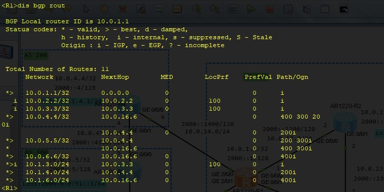
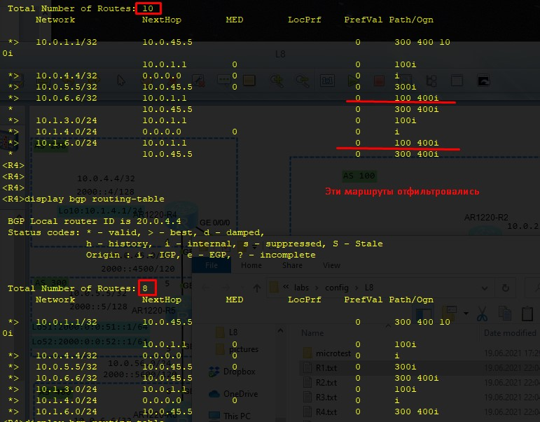
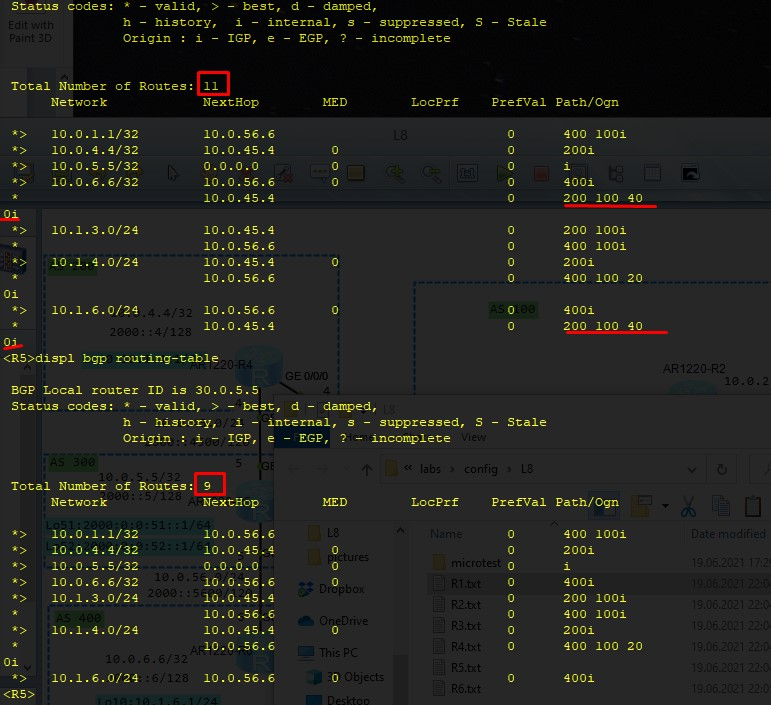
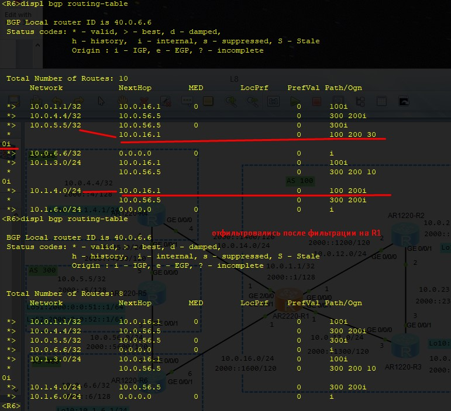
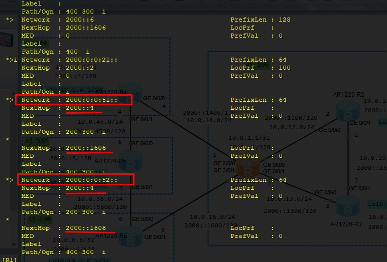
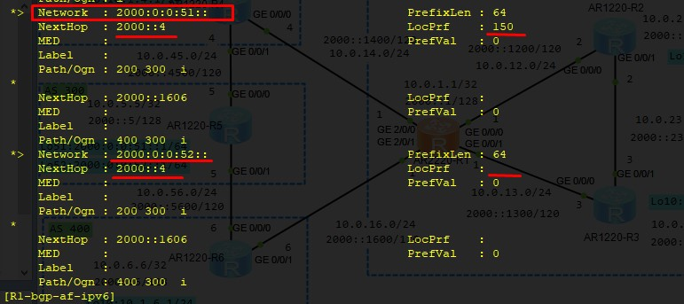
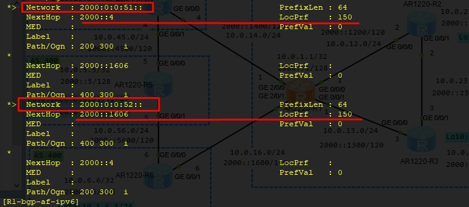
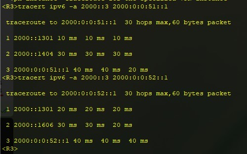

20210619

Оглавление HCIE-R&S+Lab+Guide+v3.0.pdf - стр. 05

Лабораторки 08, 09,  10

___ЛР08___
стр. 120 HCIE-R&S+Lab+Guide+v3.0.pdf

Дизайн, Адресация - на картинках ниже.

## ЗАДАНИЕ ##
1. Назначим IPv4 и IPv6 на все IF устройств. 
2. Используем OSPFv2 и OSPFv3 как IGP в AS 100
   - на IF настраиваем только ospfv3
   - в ospfv2 публикуем подсети, включая IF lo0
3. Для всех AS настроить пиринг IBGP или EBGP между устройствами с общим линкОм. Использовать IP addresses IF loopback в качестве update source для установки IBGP пиринга в AS 100. R1 и R4 также должны использовать loopback IF для установки  EBGP пиринга с использованием статических маршрутов. (настройка IPv6 BGP пиринга такая же.) Не забываем про необходимость включения IPv4/IPv6 контекстов.
4. Разослать все сети (Ipv4, IPv6) всех IF loopback 0 и добиться того, чтобы все  loopback IF топологии BGP  имели связность друг с другом. 
5. Отфильтруйте маршруты. AS 100 не должна рассылать маршруты о которых она узнавала от AS 400 и рассылала на AS200. 
6. Выбор маршрутов: Роутеры в AS 100 предпочитают ___paths passing___ через AS 200 для доступа к 2000:0:0:51::1/64, и выбирают ___paths passing___ через AS 400 к 2000:0:0:51::2/64. 

## Решение ##

R1 перед фильтрацией маршрутов от AS 400

AS200 - R4 до и после фильтрации маршрутов от AS 400, которые рассылались через AS 100

AS300 - R5 до и после фильтрации маршрутов от AS 400, которые рассылались через AS 100

AS400 - R6 до и после фильтрации маршрутов от AS 200, которые рассылались через AS 100

Маршруты в подсетки ipv6 до и после задания предпочтительного AS-PATH (увеличили вес при импорте от 2000::4)

проверка tracdert с R3

Конфиги по задаче тут: [R1](config/L8/R1.txt), [R2](config/L8/R2.txt), [R3](config/L8/R3.txt), [R4](config/L8/R3.txt), [R5](config/L8/R3.txt), [R6](config/L8/R3.txt)

