___Материал 6-го дня___ 

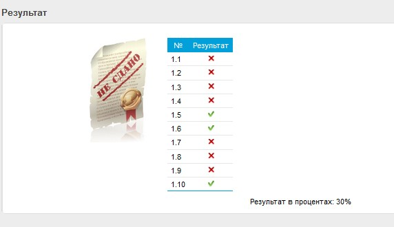   

Доп. материалы
HCIE-R&S+Theory+v1.1.pdf
01_+HCIE-R&S_Huawei_Certified_Internetwork_Expert-Routing_and_switching_material-v1.1.pdf - есть примеры, который отсутствуют в нашем учебнике

- MLD (563-593 / 00:00:00 - 00:45:17)
  - MLD Overview (567-568 / 00:04:09 - 00:13:35) - аналог IGMP, транспорт - ICMPv6
  - MLD v1 (570-YY / 00:14:01 - 00:31:45)
     - Querier Election (571-572 / 00:19:08 - 00:22:29)
     - Group Member Join 572-573 / 00:22:29 - 00:28:00)
     - Group Member Leave (574-574 / 00:28:00 - 00:31:45)
  - MLD v2 (575-YY / 00:31:45 - 00:39:16)
     - MLDv2 Query Mess Format (576 / 00:31:45 - 00:33:33)
     - MLDv2 Report Mess Format (577 / 00:33:33 - 00:36:00)
        - 01_+HCIE-R&S_Huawei_Certified_Internetwork_Expert-Routing_and_switching_material-v1.1.pdf (558-559 / 00:34:32 - 00:35:12)
     - Group-Source-Specific Query (578-579 / 00:36:00 - 00:39:16)
  - MLG Config Example (580-584 / 00:39:16 - 00:41:39)
  - SSM Mapping (585-593 / 00:41:41 - 00:45:17)
     - MLD SSM Mapping (586 / 00:41:41 - 00:44:37)
     - Config MLD SSM Mapping (587-593 / 00:44:37 - 00:45:17)

- PIM (594-650 / 00:45:17 - 01:55:00)
  - PIM-SM [sparse mode] Mechanism Overview (597-600 / 00:45:17 - 01:43:35)
     - Multicast protocols (598-599 / 00:46:57 - 00:53:23)
     - Protocols Used in MC  (600 / 00:53:23 - 00:54:10)
     - PIM-SM Overview  (601 / 00:53:23 - 01:05:22)
        - SPT (602 / 00:55:49 - 00:59:02)
        - RPT (603 / 00:59:15 - 01:03:50)
        - IPv6 PIM-SM Overview (605 / 01:04:00 - 01:05:22)
     - DR Election (606-608 / 01:05:22 - 01:21:59)
     - RP Election (609 / 01:21:59 - 01:26:00)
     - Embedded RP fundam (611-612 / 01:26:02 - 01:30:00)
     - Joining the RPT (613-614 / 01:30:13 - 01:33:00)
     - MC Src registration (615 / 01:33:00 - 01:37:23)
     - Stopping the register process (616 / 01:37:23 - 01:38:23)
     - MC traf FWD process (617 / 01:38:23 - 01:39:11)
     - RPT-to-SPT Switchover (During Switchover) (618 / 01:39:11 - 01:41:17)
     - Pruning after Switchover (619 / 01:41:17 - 01:43:35)
  - IPv6 PIM-SM Config (620-630 / 01:43:35 - 01:55:00)
  

 LAB GUIDE Л/Р 11 (201 - 220 / 01:55:00 - 01:56:30) 

  - IPv6 PIM-SSM Fundam (631-636 / 01:57:00 - 02:01:50)
     - IPv6 PIM-SSM Overview (632 / 01:57:00 - 01:58:30)
     - IPv6 PIM-SSM Fundam (633 / 01:58:30 - 01:59:00)
     - IPv6 PIM-SSM Config Ex (634-636 / 01:59:00 - 02:01:50)
  - Multicast Route Mgm (637-646 / 02:01:50 - 02:23:55)
     - MC Route MGM (638 / 02:01:50 - 02:09:28)
        - IPv6 MC protocol routing table (639 / 02:05:26 - 02:06:39)
        - IPv6 MC routing table (640 / 02:06:39 - 02:08:47)
        - MFIB (641 / 02:08:47 - 02:09:28)
     - RPF Check (642-YY / 02:09:28 - 02:20:15)
        - Доп. 00_HCIE1.1-R&S_Huawei_Certified_Internetwork_Expert-Routing_and_switching_material-v1.1.pdf (713-715 / 02:09:28 - 02:12:45)
     - MC load Splitting (645-YY / 02:20:15 - 02:23:55)
        - Доп. 00_HCIE1.1-R&S_Huawei_Certified_Internetwork_Expert-Routing_and_switching_material-v1.1.pdf (614-616; 725-728 / 02:21:00 - 02:23:45)
        - MC fwd without & with MC Load Splitting (646 / 02:23:45 - 02:23:55) - смотреть под допам, материал с ошибками
  - Typical IPv6 Multicast APP (647-650 / 02:24:00 - 02:24:19)
     - Intra-domain MC (648 / 02:24:00 - 02:24:19)

https://support.huawei.com/enterprise/en/doc/EDOC1000091883/955ce715/what-flags-are-commonly-used-in-a-pim-routing-table

LAB GUIDE Л/Р 12 (221 - 252 / 06:40:45 - 07:19:12)
LAB GUIDE Л/Р 13 (253 - 282 / 06:40:45 - 07:19:12)

- Д/З 3 (Z:\HOMEWORK) MPLS, MPLS_VPN,  (материал в txt / 02:26:00 - 07:01:23)
ДЗ 3-й недели, состояит из 3 заданий (есть видео в конце 6-го дня):
- 1-е задание MPLS, MPLS_VPN - по Lab GUIDE MPLS VPN; MPLS
- 2-е задание (02:36:00 - 02:43:08) стык из OSPF+IS-IS - предотвратить появление петель маршрутизации
   - 1,2 п.п - уже сконфигурированы
   - 3 - на R6 завести в OSPF  через редистрибуцию. OSPF NE - not Edge, просто OSPF роутер
   - 4 - НаR3, R4: взаимная редистрибуция для префиксов со 172.16
      - cost - метрика должна наследоваться при редистрибуции
      - Lo0 - по оптимальном у пути (10-я лаба)
      - избежать dual-node bi-directional route importing - предотвратить петли
- 3-е Задание (02:27:21-02:36:00): Часть оборудования преднастроена (ошибочка в п.п. 2 - смотреть в видео)
   - настроить взаимную редистрибуцию ISIS<->BGP подсетей всех IF Loopback
   - сделать матчинг по октету (чет-нечет), то есть добиться разнесения маршрутов (src/dst), чтобы при обращении к lo R5:
      - до нечетных IP - маршрут был через верх
      - до четных IP - маршрут был через низ
   -  избежать dual-node bi-directional route importing - предотвратить петли

Корректная схема
 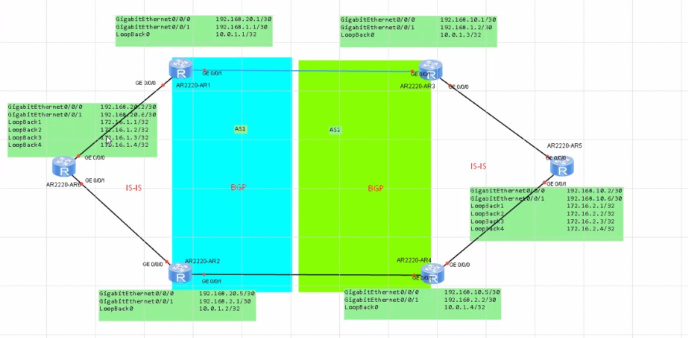

 Во вт - разбор ДЗ1, ДЗ2, ДЗ3 (2-я часть)

## Доп. материал "MC - маршрутизация" ##
- MC Principles (00:00:00 - 01:46:18)
   - MC Basis (538-539 / 00:01:46 - 00:22:00)
      - Intro (540 - / 00:01:46 - 00:05:47)
      - MC Basic Concepts (540-541 / 00:05:47 - 00:08:20)
      - MC Service Models (542 / 00:08:20 - 00:11:58)
         - посмотреть где-то про IPv4 MC
      - MC addresses (543-548 / 00:11:58 - 00:18:01)
         - IP (543-547 / 00:11:58 - 00:15:28)
         - MAC (547-548 / 00:15:28 - 00:18:01)
      - MC Proto (548- / 00:18:01 - 00:22:00)
         - IGMP (IPv4) или MLD (IPv6) (549) - отвечает за обнаружение получателей
         - IGMP Snooping/MLD Snooping - формируется некая таблица. с заинтересованными получателями (а не на все порты VLAN)
         - PIM (внутри-domain)/MSDP(меж-domain)/MBGP(между AS - MultiProtocol BGP)/Static (549)
   - IGMP ( 553- / 00:22:00-00:48:40)
      - IGMP overview (553 / 00:22:40-00:23:36)
      - IGMPv1 (553 - 556 / 00:23:36-00:32:52)
         - Messages (запрос/ответ/нет запроса на Leave)
            - GenQuery (224.0.0.1; 1 time per 60 sec или самим хостом на MC 224.0.0.1);
            - Reports (timer to answer on GenQuery 0-10 sec)
         - Querier=DR
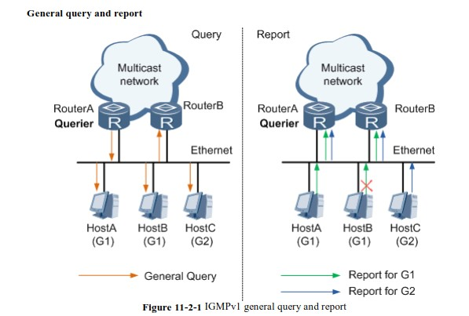
            - querier add entry in MC routing protocol (*, Gq); (*, G2)...
      - IGMPv2 (556 - 558 / 00:32:52-00:38:56)
         - Messages: все старые+
            - Group-Spec query (querier проверяет членство)
            - Leave (хост отзывает свое членство в группу/224.0.0.2/querier запускает таймер и отправляет Group-Spec query - есть ли кто-то в группе еще: если ответа нет - удалем entry (*, G<X>))
         - Querier=DR (отдельный процесс выбора по min IP и таймер ожидания на перевыборы)
      - IGMPv3 (558 - 651 / 00:38:56-00:43:28) - тут уже возможно указывать от каого src хотелось бы получать MC
         - Messages (report - уже на 224.0.0.22)
            - Group-and-Source-Specific Query (Querier запрашивает адресатов о MC от определенного SRC)
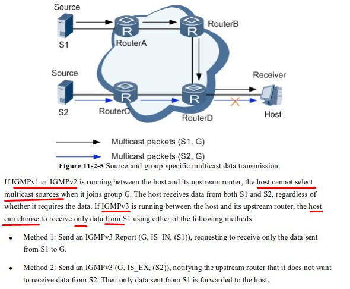            
         - Filter modes (S-source)
            - Include (G, INCLUDE, (S1, S2...))
            - Exclude (G, EXCLUDE, (S1, S2...))
      - Совместимость IGMP версий (- / 00:43:28-00:45:40)
      - IGMP SSM Mappings (561 - 562 / 00:45:40 -00:48:40)
   - L2 MC (562 - / 00:48:40 - 00:22:00)
      - IGMP/MLD Snooping ( 562-569 / 00:48:40 - 00:52:51)
      - IGMP/MLD Snooping Proxy (569-571)
      - Layer 2 SSM Mapping (571-573)
      - Multicast VLAN ( 573-576 / 00:52:51 - 00:55:21)
      - Multicast CAC (577)
      - Controllable Multicast (579)
   - PIM (581-608 / 00:55:21 - 01:43:15)
      - Basic (581-582 / 00:55:21 - 01:03:58) (дерево MDT - SPT (shortest - конкретный SRC (S, G<N>)) or RPT (randevouz - любой (*, G<N>)); A, B, C - leaf R; E - First-hop R; A, B - также last-hop R; D - intermediate R)
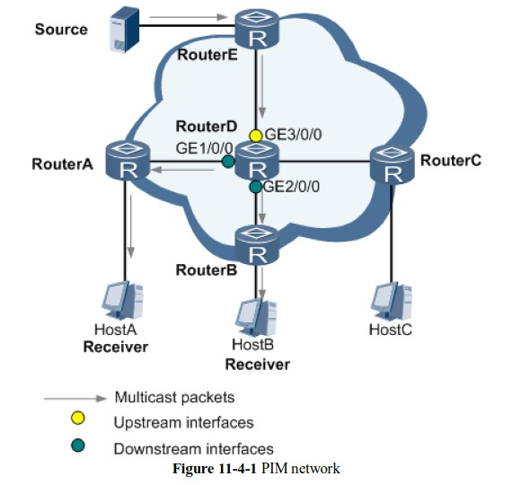        
      - PIM-DM (583-590 / 01:03:58 - 01:20:39) (SPT или RPT) - флудим всем PIM - R
      - PIM-SM (591-598 / 01:20:39 - 01:42:14) (RPT)
      - PIM-SSM (598-608 / 01:42:14 - 01:43:15)
   - MC routing MGM (- / 01:43:15 - 01:46:18)
      - RPF Check (609 - 611 / 01:43:15 - 01:45:26)
      - Static MC routing (611- / 01:45:26 - 01:46:18)
   - Multicast in BGP/MPLS IP VPN (619)
- MC config command (621-734 / 01:46:18 - 01:58:25)
   - Config PIM-DM (668-676 / 01:46:18 - 01:52:00)
   - Config PIM-SM (621-668;676-734 / 01:52:00 - 01:58:25) ```display igmp interface```; ```display pim routing-table```
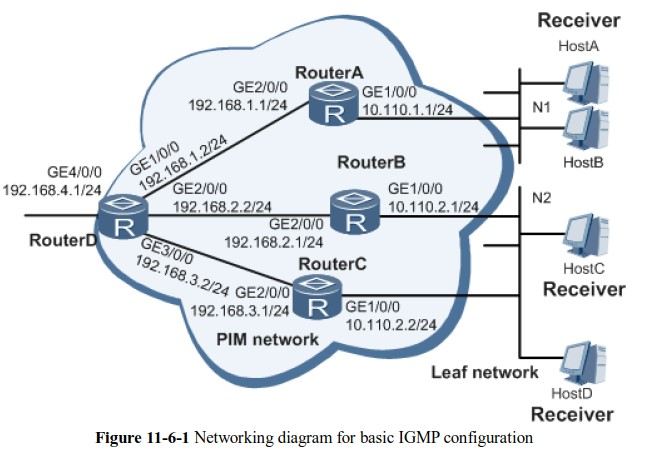    
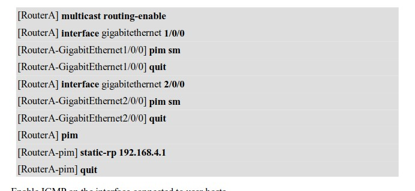           
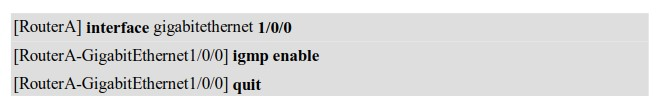           
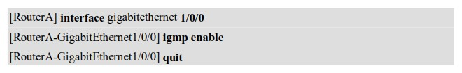   
- MC TS (617-619 / 01:58:25 - 02:03:59)
- MC case analysis (- / 02:03:59 - 02:17:35)
- MC exam prep (- / 02:17:35 - 02:27:00)


- NAT (02:28:00 - 02:39:00)
   - Priv & Pub addr (02:28:00 - 02:28:33)
   - NAT behavior (02:28:33 - 02:28:45)
   - Static NAT (02:28:45 - 02:30:45)
   - Dynamic NAT (02:30:45 - 02:31:25)
   - NAPT (dyn NAT+port translation) (02:31:25 - 02:32:00)
   - Easy IP (аналог NAT overload) (02:32:00 - 02:32:33)
   - Nat Internal Server (проброс портов) (02:32:33 - 02:33:07)
   - Configuration
      - Static (02:33:07 - 02:34:01)
      - Dynamic (02:34:01 - 02:35:56)
      - Easy IP (02:35:56 - 02:36:56)
      - Nat Internal Server (02:36:56 - 02:39:00)

Материалы по доп. модулю

- MC: 00_HCIE1.1-R&S_Huawei_Certified_Internetwork_Expert-Routing_and_switching_material-v1.1.pdf


На экзамене могут встречаться вопросы и про ipv4 MC, чего нет в HCIE. HCIE - только ipv6.

MC-маршрутизация для рассылки Pt-to-MP. Недостаток - отсутствие гарантии доставки (UDP). Необходимо включать доолнительно на роутерах. Идет от сервера - группе получателей.

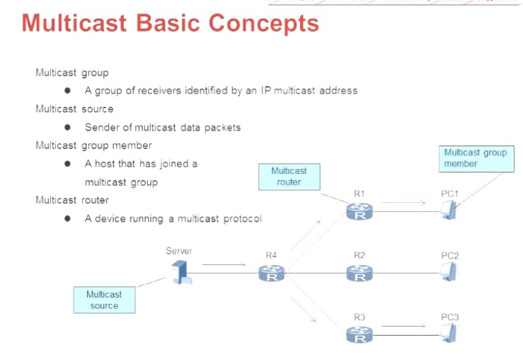

- ___MC group___ - конечные пользователи трафика, которые идентифицируются по групповому Multicast IP. 
- ___MC source___ - это источник MC пакетов, отправитель
- ___MC group member___ -  подтверждают заинтересованность в трафике с определенного группового адреса (сообщения IGMP, MLD). Их GW - R1, пытается построить дерево MDT [multicast distribution tree]
- ___MC router___ - учаcтник построения дерева, с запущенным протоколом маршрутизации, пропускает через себя MC трафик

## Модели трафика ##

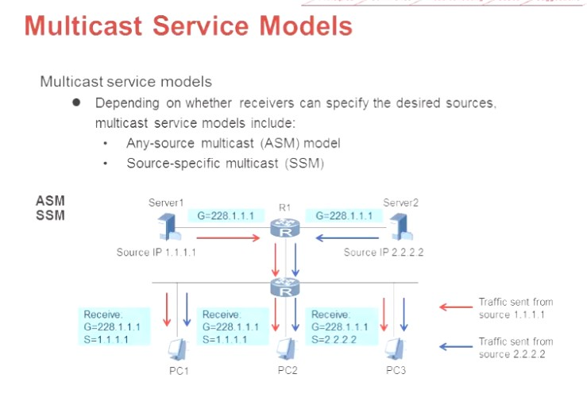

- ASM 
   - получателю не важно кто является MC-src и сообщают на какой идентификатор (ip MC Group) им нужно отправлять трафик
   - последний Last-hop R строит MDT снизу вверх а трафик идет вниз по дереву
- SSM 
   - получатель сообщает ip-адрес MC-src, ему интересен. Сообщает ip-адреса SRC-ов
   - последний Last-hop R строит MDT снизу вверх к конкретному SRC, и трафик идет вниз по дереву

## MC - адреса ##


- 224.0.0.5, 224.0.0.6 - OSPF
- 224.0.0.13 - PIM for IPv4
- ASM group address - планировалось выдавать вместе с AS, но от идеи отказались.
- Default SSM group address
