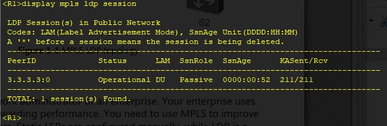

20210619

Оглавление HCIE-R&S+Lab+Guide+v3.0.pdf - стр. 05

Лабораторки 11

___ЛР11___
стр. 202 HCIE-R&S+Lab+Guide+v3.0.pdf

Дизайн, Адресация - на картинках ниже.


## ЗАДАНИЕ ##
1. Настроить IP на всех IF R и сконфигурировать unicast routing протокол. 
2. Включить multicast на всех роутерах, PIM-SM на каждом IF, и IGMP на IF к которому подключен хост. 
3. Сконфигурировать одинаковый статический IP RP адрес на всех R. 
4. Сконфигурировать SPT switchover на Router C. 

## Решение ##

Настройка IF, OSPF - все просто

Вторая часть

Вкл Multicast, PIM-SM на каждом IF а на ACCESS порту - еще и IGMP
```
multicast routing-enable 
interface GigabitEthernet 0/0/1 
pim sm 
quit 

interface GigabitEthernet 0/0/2 
pim sm 
quit 

interface GigabitEthernet 0/0/3
pim sm 
igmp enable
quit 

display pim neighbor 
```


Configure a static RP on Router A, Router B, and Router C

```
pim 
static-rp 192.168.1.1 
quit 
```

Вывод об отказоустойчивости. после отключения IF 0/0/2 на RB


Конфиги по задаче тут: 
[RouterA](config/L11/RouterA.txt), 
[RouterB](config/L11/RouterB.txt), 
[RouterC](config/L11/RouterC.txt)


___ЛР12___
стр. 221 HCIE-R&S+Lab+Guide+v3.0.pdf

Дизайн, Адресация - на картинках ниже.


## ЗАДАНИЕ ##
1. Настроить IP для каждого IF R и настроить unicast routing protocol. PIM - intra-domain multicast routing protocol that depends on unicast routing protocols. 
2. Включить multicast на всех multicast R. перед настройкой PIM-SM, необходимо enable multicast. 
3. Включить PIM-SM на всех IF multicast роутеров. Сконфигурировать другие 
PIM-SM функции можно будет только после PIM-SM активации. 
4. Включить IGMP на IF подключенном к hosts, и переведите IGMP версию 
к IGMPv3. Получатель может подключиться и отключиться к multicast group определенного источника отправив специальное сообщение IGMP. Роутеры leaf (См/ leaf-spine) поддерживают отношения multicast member посредством IGMP. 
5. Задайте SSM групповой диапазон на всех роутерах, так чтобы multicast routers в PIM-SM домене предоставляли сервис для multicast groups в диапазоне адресов SSM. 

## Решение ##


Конфиги по задаче тут: 
[R1](config/L12/R1.txt), 
[R2](config/L12/R2.txt), 
[SW1](config/L12/SW1.txt), 
[SW2](config/L12/SW2.txt), 
[SW3](config/L12/SW3.txt)


___ЛР13___
стр. 253 HCIE-R&S+Lab+Guide+v3.0.pdf

Дизайн, Адресация - на картинках ниже.


## ЗАДАНИЕ ##
1. Настроить IPv6 на всех IF. 
2. Настроить IS-ISv6 на R1, R2, R3, R4 и R5 для глобальной IPv6 связности. 
3. Включить IPv6 MC на всех R задействованных в MC. 
4. Включить IPv6 PIM-SM на всех IF роутеров, задействованных в MC. IPv6 PIM-SM функционал включится только после активации IPv6 PIM-SM. 
5. Включите MLD на IF R через которых подключены хосты и сконфигурируйте IF на статический join к MC группе. Получатель joins и leaves MC группу отправляя MLD сообщение. leaf routers поддерживают MC членство посредством MLD. 
6. Настройте RP. В IPv6 PIM-SM domain, RP is essential in providing ASM services и помогает транслировать MC данные. Настраивать RP рекомендуется на R у которого максимальное числа MC branches. Например, настройте R5 как RP сети. 

## Решение ##


Конфиги по задаче тут: 
[R1](config/L12/R1.txt), 
[R2](config/L12/R2.txt), 
[SW1](config/L12/SW1.txt), 
[SW2](config/L12/SW2.txt), 
[SW3](config/L12/SW3.txt)


___HW3___
стр. 253 HCIE-R&S+Lab+Guide+v3.0.pdf

Дизайн, Адресация - на картинках ниже.


## ЗАДАНИЕ ##
1. Вкл/выкл MPLS. 
2. Вкл/выкл MPLS LDP [Labed Distribution Protocol]: После включения LDP LSR делает мультикастовую рассылку UDP-дейтаграмм во все интерфейсы на адрес 224.0.0.2 и порт 646, где активирован LDP — так происходит поиск соседей.
3. Настройка LSP с использованием MPLS LDP. LSP — Label Switched Path — путь переключения меток. Это однонаправленный канал от Ingress LSR до Egress LSR, то есть путь, по которому фактически пройдёт пакет через MPLS-сеть. Иными словами — это последовательность LSR.
4. Конфигурирование LDP LSP политики на MPLS роутере

## Решение ##
0. Настраиваем IF и включаем протоколы динамической маршрутизации
```
interface ser0/0/2
link-proto ppp
ip address 10.0.23.1 24
quit

interface GigabitEthernet 0/0/1
ip address 10.0.2.1 24
quit

interface loo 0
ip address 4.4.4.4 24
quit


### включаем OSPF2
ospf 1 router-id 4.4.4.4
silent-interface ser 0/0/1
silent-interface Gi 0/0/2
 area 0.0.0.0 
netw 10.0.23.0 0.0.0.255
netw 10.0.2.0 0.0.0.255
quit
```


1,2. MPLS
```
### Настройка mpls и включение Глобально
mpls lsr-id 4.4.4.4
mpls
mpls ldp

### Настройка mpls и включение на IF
interface ser0/0/2
mpls
mpls ldp
```
display mpls ldp session - Видно что статус сессии Operational




3. Настройка LSP с использованием MPLS LDP

Видны какие-то метки


Ну и включаем: стали видны все маршруты


4. Настройка политик: судя по лабе - политика inbound
```
ip ip-prefix prefix1 permit 10.0.12.0 24 
mpls ldp 
inbound peer 3.3.3.3 fec ip-prefix prefix1 
quit 
```

количество префиксов изменилось, но зачем - не понял


Конфиги по задаче тут: 
[R1](config/HW3/R1.txt), 
[R2](config/HW3/R2.txt), 
[R3](config/HW3/R3.txt), 
[SW1](config/HW3/SW1.txt), 
[SW2](config/HW3/SW2.txt)