20210608

Программа первого вебинарного дня. Теоретический блок и 1 лабораторная работа.

Владислав Цуцков
Версия учебника ___HCIE-R&S Theory v3.0.pdf___ - 
Лабораторки ___Лабы LAB GUIDE 3.0___ - нормальные отзывы от преподавателя
Лабораторки ___Лабы HCIE-R&S+Theory+v1.1___ - Что-то рассмотрено блее подробно, чем в ver 3.0

Configuration Examples iStack
https://support.huawei.com/enterprise/en/doc/EDOC1000047416?section=j00c
https://support.huawei.com/enterprise/ru/doc/EDOC1000044778/91449095/configuration-examples

E-Trunk
https://support.huawei.com/enterprise/en/doc/EDOC1000178168/83eed721/e-trunk
https://support.huawei.com/enterprise/en/doc/EDOC1000178310/cff339b5/example-for-configuring-connecting-an-e-trunk-to-a-vpls-network

https://forum.huawei.com/enterprise/ru/hcie-r-s-%D1%83%D1%87%D0%B5%D0%B1%D0%BD%D1%8B%D0%B5-%D0%BC%D0%B0%D1%82%D0%B5%D1%80%D0%B8%D0%B0%D0%BB%D1%8B/thread/689393-100567

Ключевые темы
BGP
MPLS VPN
Route Control
OSPF
IS-IS (из v 1.1)

Лаба 1, 2 - сделать до Чтв.

## MSTP (стр 5-27)## 
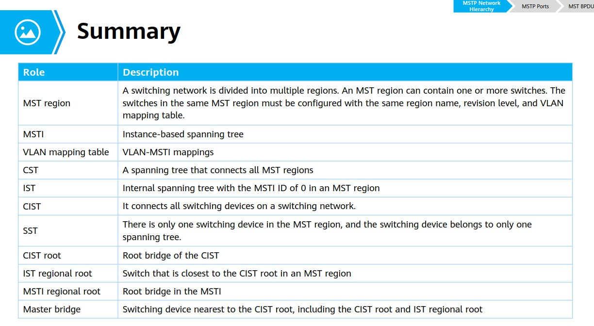

https://habr.com/ru/post/419785/

## iStack/стекирование (стр 28-56)##

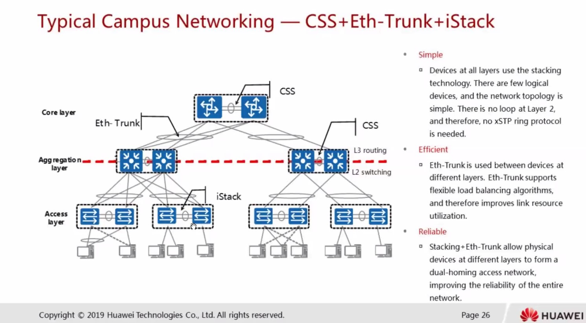
Дает нам:
- синхронизацию Control + Data Plane-ов между физическими коммутаторами
- Используется Multichassis ethertrunk, 
- упрощается STP топология L2

при сборке стека настраивается стек-линк
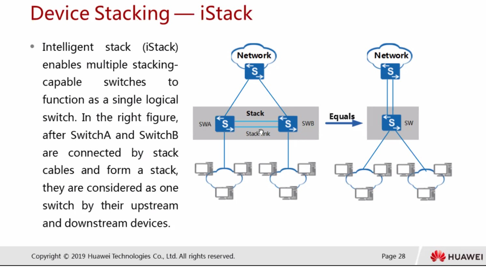
- выбирается мастер, который отвечает за работу коммутаторов в iStack

## Eth-trunk (стр 57-73) ##
Прослушали материал, запускаем лабу (Стр. 17-28):

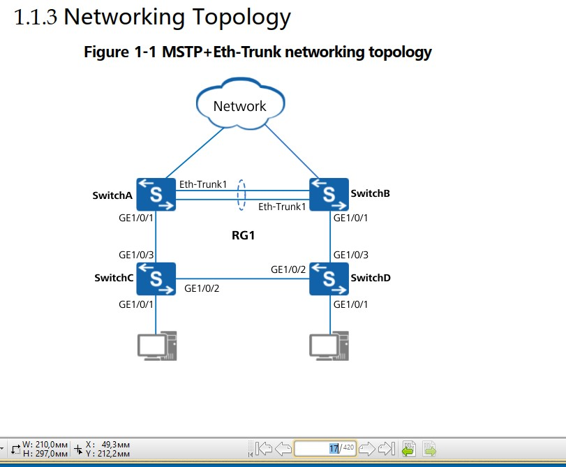

## WAN-Technologies (стр 73-136) ##
### PAP Au 108-109 ###
### CHAP Au 110-114 ###
### NCP 115-117 ###
### MP (Multilink PPP) 118-123 ###

Способ с CHAP
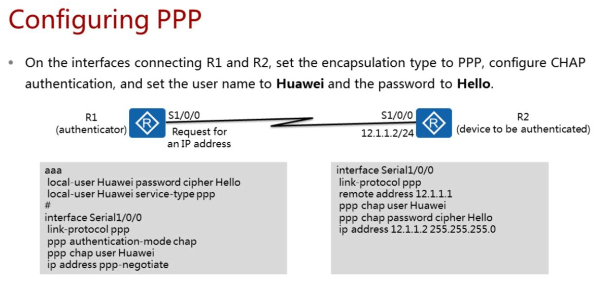
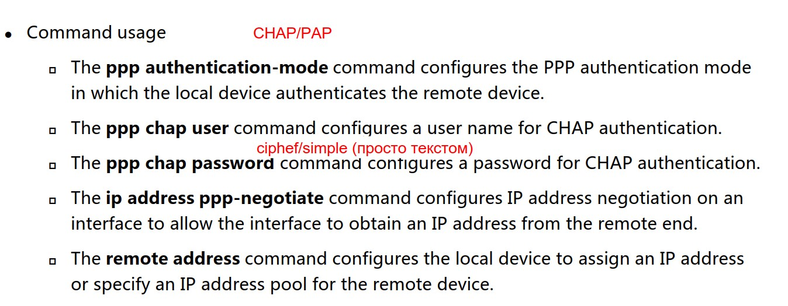

Способ с PAP
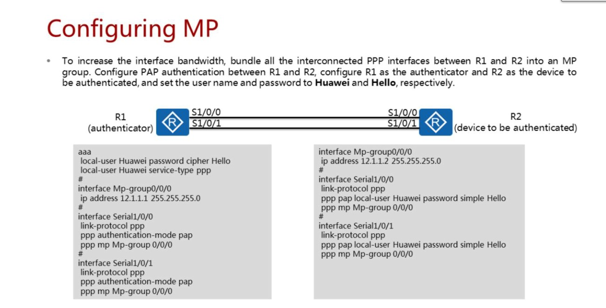

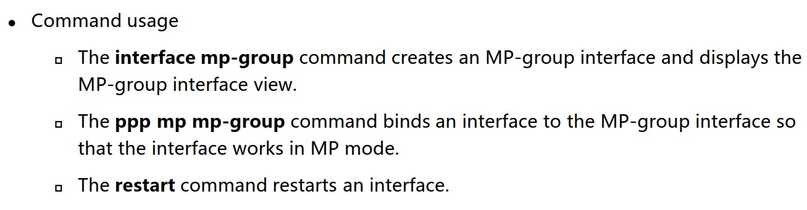

### IP-Trunk 124-126 ###
Trunk interfaces are classified:
- An Eth-Trunk consists of only Ethernet links.
- An IP-Trunk consists of POS interfaces.

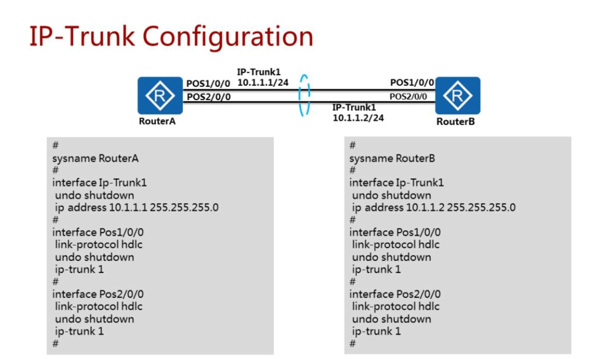

### IP-Trunk 127-136 mas ###
PPP превращает PPP-кадры в ETHERNET-кадры. Для подключения к серверу доступа и последующему выходу в интернет или доступу к ресурсам LAN. At the PPPoE session stage, the PPPoE server and client send all Ethernet data packets in unicast mode. Ресь по-сути идет про обмен информацией с некой базой данных пользователей.

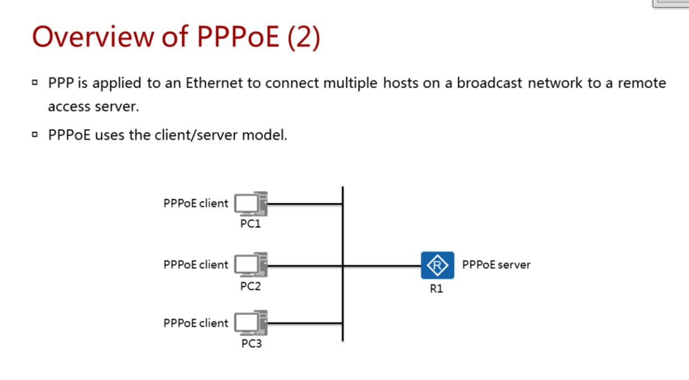

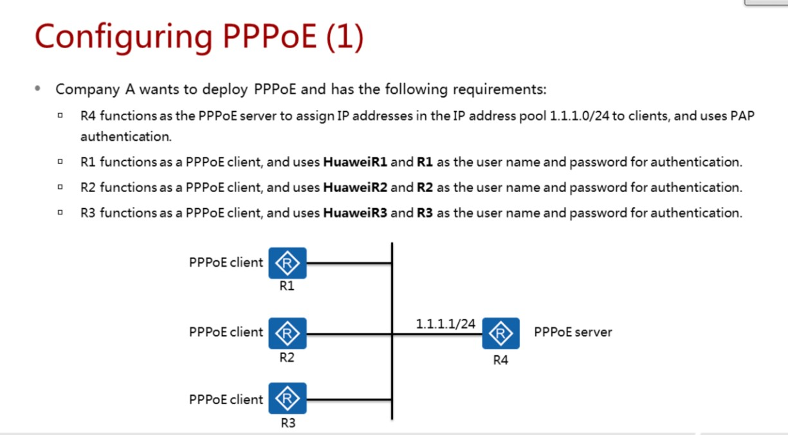

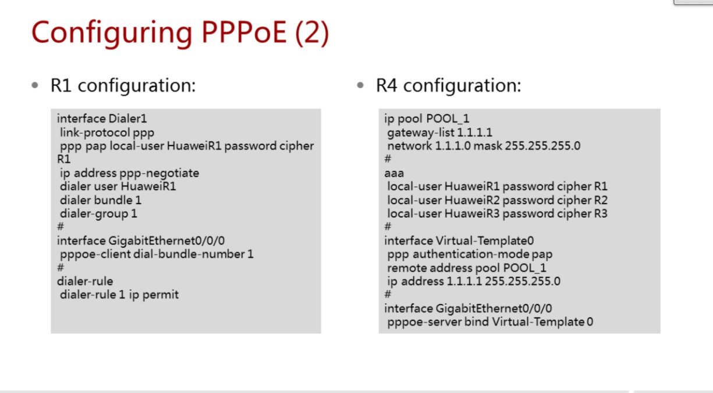

http://www.omavel.in/all/ensp-20v100r003c00/

Окончание - страница 136

Следующая лекция: IPv6, OSPFv3
Следующая лаба: 3,4,5