20210608

Оглавление HCIE-R&S+Lab+Guide+v3.0.pdf - стр. 05

Лабораторки 01, 02

___ЛР01___
стр. 17 HCIE-R&S+Lab+Guide+v3.0.pdf

Дизайн, Адресация - на картинках ниже.

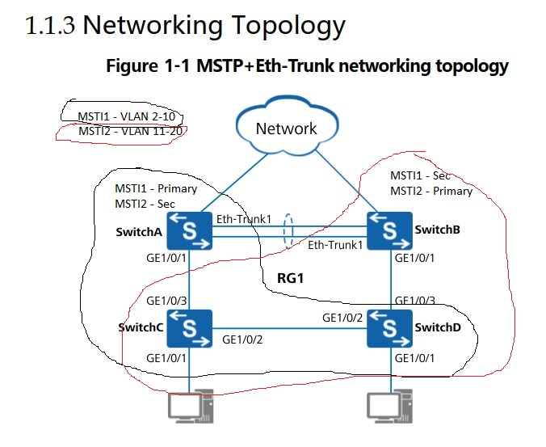
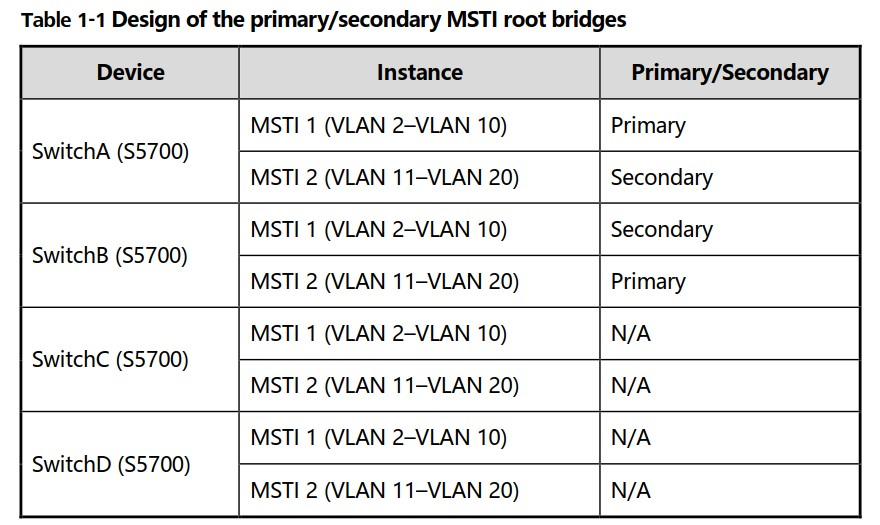

## ЗАДАНИЕ ##
1. Настройка MSTP функционала на всех SW. На ACCESS, порты сотрящие на PCs не должны участоввать в MSTP и их конфигурить в edge ports. 
2. Настроить базовую защиту линков. Например, настроить root protection для designated ports у root bridge в каждом MSTI. 
3. Настроить функционал Layer 2 forwarding на SW. 

## Решение ##

Сброс и настройка группы портов
```
reset saved-config

port-group ITPorts
group-member gi 0/0/2 to gi 0/0/3
```

Настройки SW практически одинаковы.
```
system-view 
sysname SwitchA 
 
### Добавляем VLAN
vlan batch 2 to 20

### Конфигурируем MST регион
stp region-configuration
region-name RG1 
instance 1 vlan 2 to 10 
instance 2 vlan 11 to 20 
active region-configuration 
quit 
```

Задаем в CORE SWC - ROOT для MSTI instance 1 (на SWB - наоборот)
```
stp instance 1 root primary
stp instance 2 root secondary
```

Включение проприетарщины HUA для корректного расчета pathcost и на ACCESS SWC, SWD - ___отравляем___ линк на соответствующий instance MSTI, чтобы он гулял на нужного ROOT
```
stp pathcost-standard legacy

### Делаем максимальной стоимость пути для MSTI2, чтобы порт проигрывал при расчете MSTP
interface gigabitethernet 0/0/2
stp instance 2 cost 20000
quit

### Включаем STP
stp enable
```

Защита линков
- Безопасность для CORE: Включение Security на DP у рута вниз, к ACCESS-SW
```
interface gigabitethernet 0/0/1
stp root-protection
quit
```

- Безопасность для ACCESS: обязатeльно обе команды совместно
```
### Глобально
stp bpdu-protection
### Заблочить данный порт, если получишь BPDU (обязательно stp bpdu-protection), а также исключить его из MST расчетов
interface gigabitethernet 0/0/1 
stp edged-port enable
quit

### Активтируем на порту VLAN2
interface gigabitethernet 0/0/1
port link-type access
port default vlan 2
quit 
```

Включение функционала Forwarding L2: в базовом конфиге на CORE настраиваем Eth-trunk 1 из двух IF и уже на всех SW делаем соответствующие транки на аплинках
```
interface Eth-Trunk 1 
trunkport gigabitethernet 0/0/2 
trunkport gigabitethernet 0/0/3 
port link-type trunk 
port trunk allow-pass vlan 2 to 20
quit

### Транк на аплинках
interface gigabitethernet 0/0/1
port link-type trunk 
port trunk allow-pass vlan 2 to 20 
quit 
```

Видно как уже работает MSTP для разных MSTI: рутом делается сосед

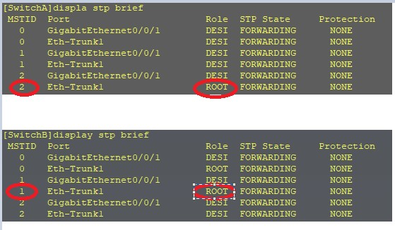

Проверка:
Видно работу за регион
```displa stp region-configuration```
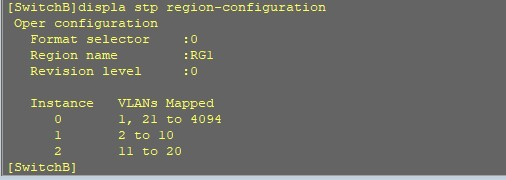

```display stp instance 2 | include Root```
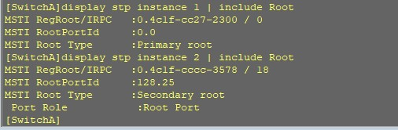

```display stp topology-change```
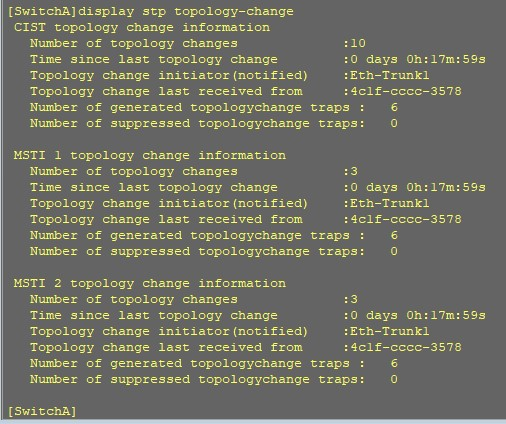


Итак MSTP построено таким образом:
- регион 1 настроен на всех SW
- MSTI1 - primary SwitchA
- MSTI2 - primary SwitchB
- Транковые порты ACCESS-уровня Gi0/0/2 - имеют высокую стоимость и будут в состоянии ___ALTE  DISCARDING___:
   - Слева для MSTI2 (stp instance 2 cost 20000)
   - Справа для MSTI1 (stp instance 1 cost 20000)
- Так как правильно настроена стоимость, использоваться до Distribution уровня будут аплинки, а для достижения нужного рута - Eth-trunk. Выглядеть это будет как нарисовано на схеме стрелочками:  
   - если трафик VLAN 2-10 (MSTI1) окажется на SwitchD, то он пойдет через верх налево 
   - если трафик VLAN 11-20 (MSTI2) окажется на SwitchC, то он пойдет через верх направо

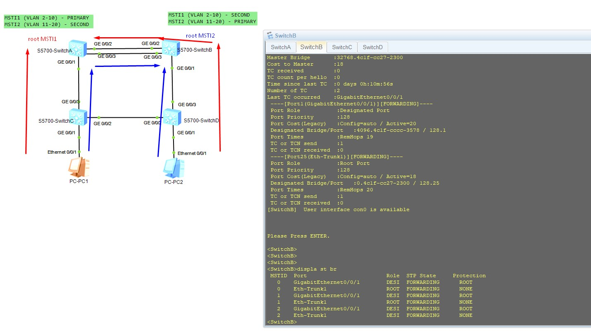

- Только в случае отвала аплинка, MSTP перестроится и трафик пойдет через промежуточный транк между ACCESS свичами  

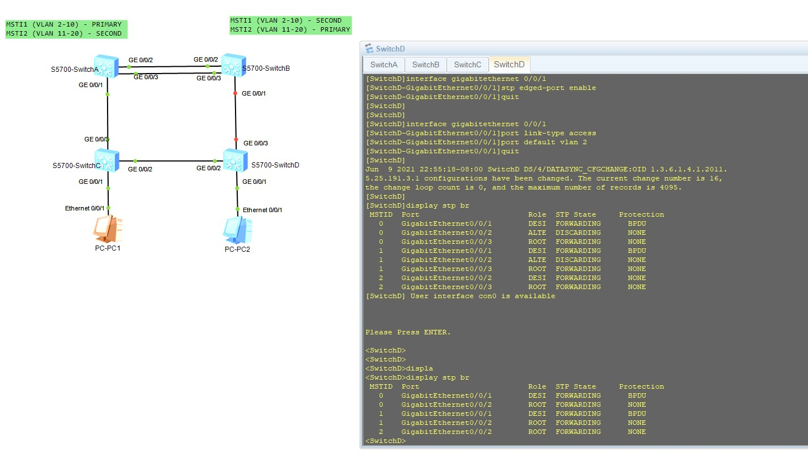

Конфиги по задаче тут: [SWA](config/L1/SWA.txt), [SWB](config/L1/SWB.txt), [SWC](config/L1/SWC.txt), [SWD](config/L1/SWD.txt)

Ну и чуть-чуть допов: есть информация, что MSTP региона, который должен быть одинаковым на всех участниках в регионе, вычисляется как хэш и передается в открытом виде

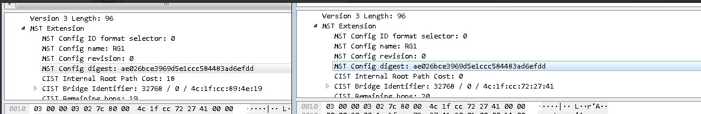

___ЛР2___

стр. 29 HCIE-R&S+Lab+Guide+v3.0.pdf

Дизайн, Адресация - на картинках ниже.

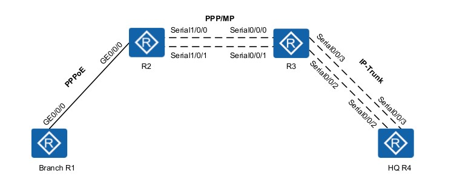

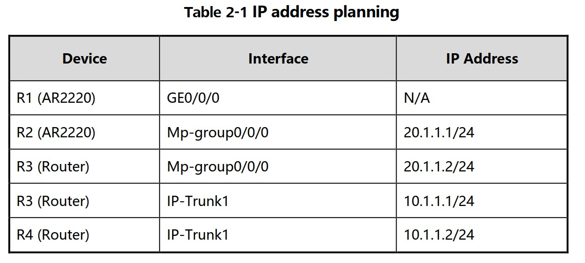

## ЗАДАНИЕ ##
1. Настроить PPPoE клиента и сервера на R1 и R2 соответственно. 
2. Настроить serial и собрать их в MP на R2 и R3. 
3. Настроить serial и собрать их в IP-Trunk на R3 и R4. 
4. Настроить статик так, чтобы появилась связность R1 and R4 по IPv4.

## Решение ##

1. Настройка PPPoE
___Server___
```
### Задаем pool 
ip pool pool1
network 1.1.1.0 mask 255.255.255.0
gateway-list 1.1.1.1
quit

### Создаем пользователя
aaa
local-user HuaweiR1 password cipher R1
local-user HuaweiR1 service-type ppp
quit

### Создаем virt template
interface Virtual-Template 30
ppp authentication-mode pap
remote address pool pool1
ip address 1.1.1.1 24
quit

### Вешаем шаблон на If
int gi 0/0/0
pppoe-server bind virtual-template 30
```

___Client___

```
### создаем aCL 100 на инициацию PPPOE-сессии (пример - ip-трафик), укажем его позхже, в dialer-group

dialer-rule
dialer-rule <100> ip permit
quit

### Настройка PPPoE: IF тип dialer № 1
int Dialer 1
link-protocol ppp
ppp pap local-user HuaweiR1 password cipher R1
ip address ppp-negotiate
dialer user HuaweiR1
dialer bundle <10>
dialer-group <100>
quit

### Конфигурим IF на использование bundle 10
int gi 0/0/0
pppoe-client dial-bundle-number <10>
quit
```
PPPoE - сессия поднялась, проверка ```display interface Dialer 1```

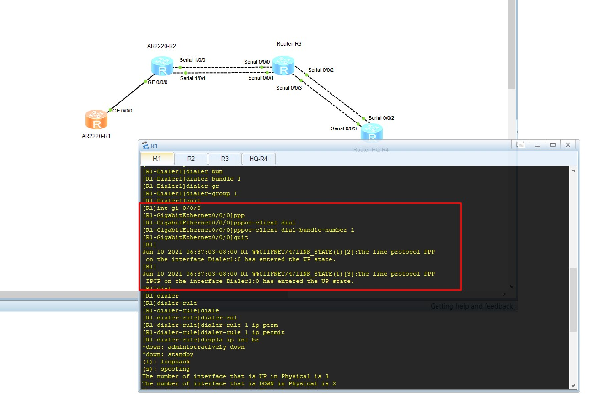

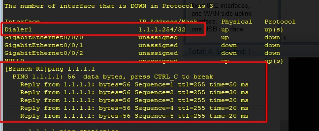

2. Настройка PPP/MP

Authenticator (обрабатывает запрос на аутентификацию). В теории приведена картинка на CHAP. Здесь конфиг на PAP, то есть к Authenticator прилетает запрос на аутентификацию (plaintext username/pass) и он его согласовывает/отказывает на основании данных из локальной БД
```
### Добавляем пользователя
aaa
local-user Huawei password cipher Hello	
local-user Huawei service-type ppp
quit

### Настраиваем MP-group
interface Mp-group 0/0/0
ip address 20.1.1.1 24
quit

### Назначаем IF MP-Group
int s1/0/0
link-protocol ppp
ppp authentication-mode pap
ppp mp Mp-group 0/0/0
quit

int s1/0/1
link-protocol ppp
ppp authentication-mode pap
ppp mp Mp-group 0/0/0
quit
```

Authenticated (тот, кого будем аутентифицировать)
```
### Настраиваем MP-group
interface Mp-group 0/0/0
ip address 20.1.1.2 24
quit

### Назначаем IF MP-Group
int s0/0/0
link-protocol ppp
ppp pap local-user Huawei password cipher Hello
ppp mp Mp-group 0/0/0
quit

int s0/0/1
link-protocol ppp
ppp pap local-user Huawei password cipher Hello
ppp mp Mp-group 0/0/0
quit

```

сессия поднялась только после того, как на R2 добавил все IF в виртуальный линк

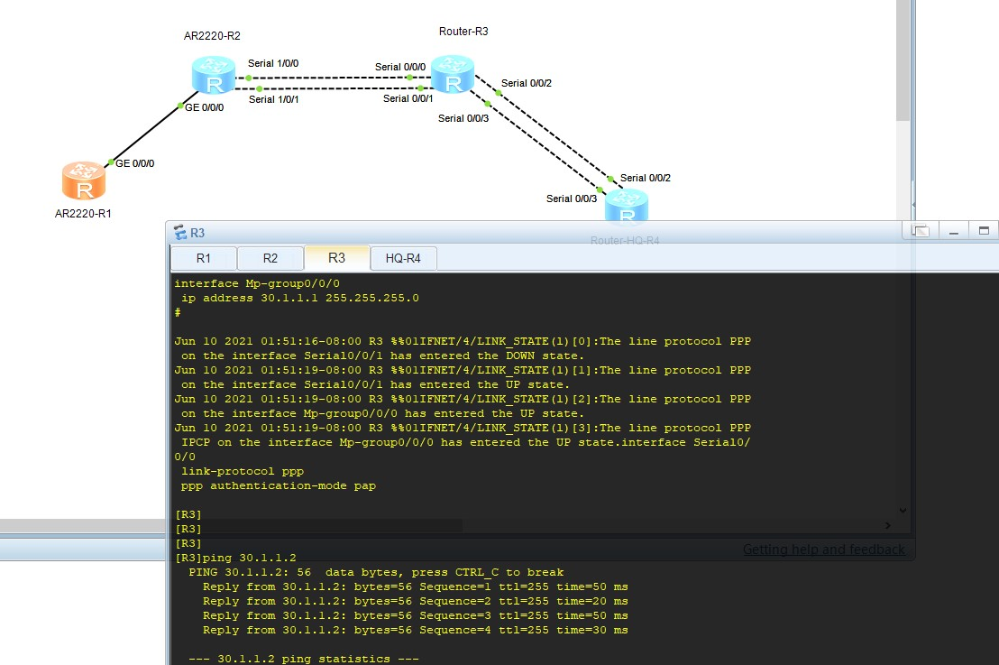

3. Настройка IP-Trunk

Выполняется аналогично с обоих сторон, только на SO - интерфейсах:
```
### Назначаем IF IP-Trunk
int Ip-Trunk 1
ip address <10.1.1.1 24>
quit

### Назначаем протокол на serial в сторону HQ
int s0/0/2
link-protocol hdlc ### надо подтвердить Y
ip-trunk 1
quit

int s0/0/3
link-protocol hdlc ### надо подтвердить Y
ip-trunk 1
quit

```

on R3 and R4 - сессия поднялась: просто копипастить нельзя, так как нужно подтверждение о смене типа на ___hdlc___

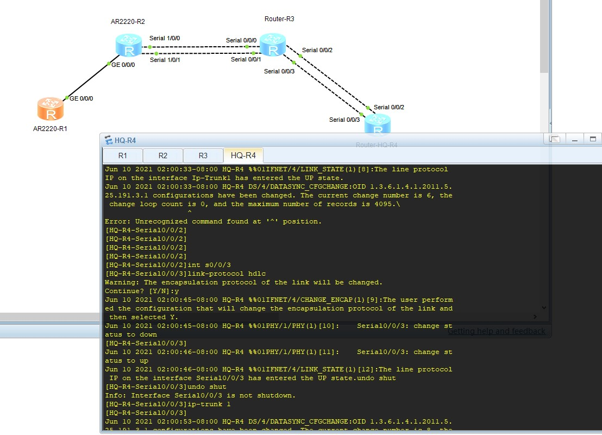