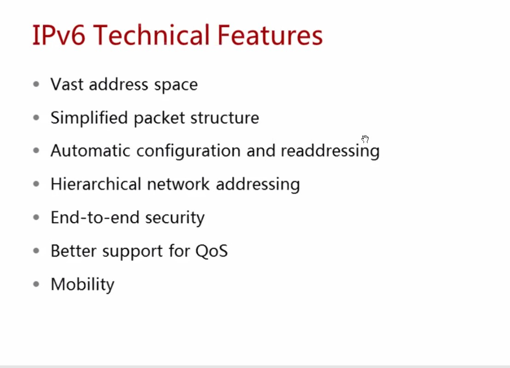
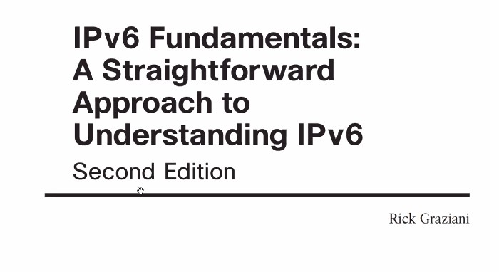
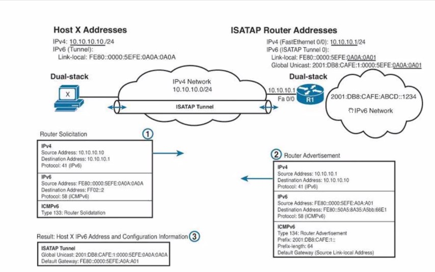

20210610

Программа первого вебинарного дня. Теоретический блок и 3 лабораторных работы

Владислав Цуцков
Версия учебника ___HCIE-R&S Theory v3.0.pdf___ - 
Лабораторки ___Лабы LAB GUIDE 3.0___ - нормальные отзывы от преподавателя
Лабораторки ___Лабы HCIE-R&S+Theory+v1.1___ - Что-то рассмотрено блее подробно, чем в ver 3.0

Дп. материалы:
22 IPv6 Address Configuration.pdf
20 Introduction to IPv6.pdf
21 ICMPv6 and NDP.pdf

Ключевые темы
IPv6 
Лаба 3, 4, 5 - сделать до Птн.

Добрый день, уважаемые курсанты!
Напоминаем вам, что к нам обратился Тони Старк за помощью, ему необходимо раздобыть координаты камней хроник Акаши. 🌍
Вы можете ему помочь, пройдя квест, где полученные знания 1 блока помогут вам!
✅Квест будет доступен с 11 по 13 июня до 20.00. 

В пятницу, 11 июня вам придёт ссылка в Мираполис, где вы найдёте подробную инструкцию для прохождения.

❗️Если потребуется помощь в подключении или прохождении квеста обращайтесь к @keaful (техподдержка будет доступна все 3 дня с 10.00 до 19.00)

Желаем вам удачи

## IPv6 146 - 218 ##

### ISATAP ###
методички. которая демонстрируется - не нашел (IPv6 fundamentals). стр 557

А можно еще раз, откуда взялось AAAA в адресе полученном от DNS64?
Ответ 14:31 на записи

## OSPF 219 - ##
Заучить нюансы по LSA OSPF v2

материалы по OSPF - 01 Advanced IGP Features.pdf

Л/Р 4, 5 - самостоятельно
+
Д/З 1 (Z:\HOMEWORK)

