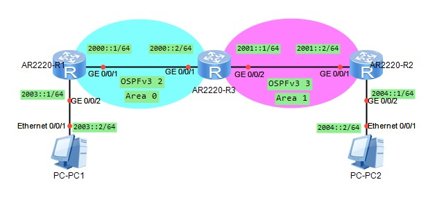
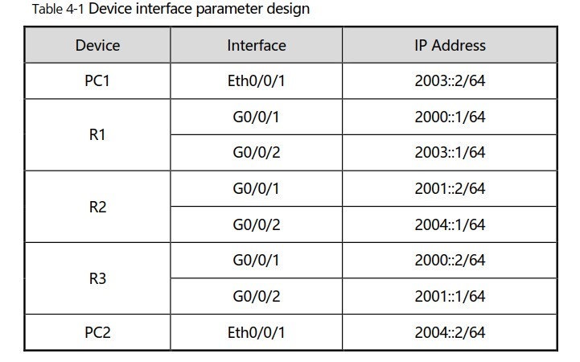
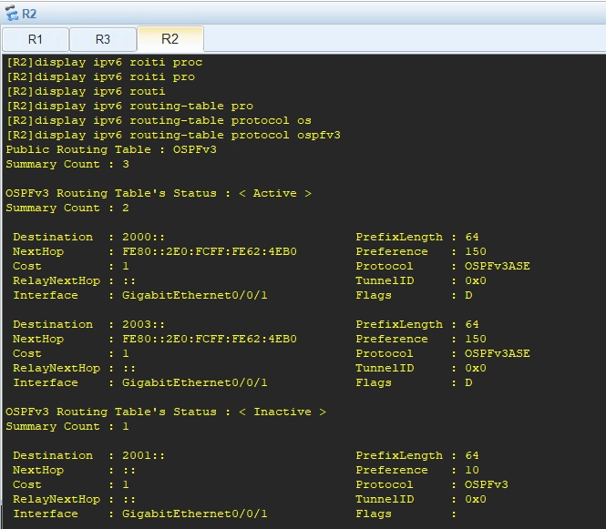

20210608

# Задача Lab3: #
Настроить IPv6 прохождение трафика в туннеле. Дизайн, Адресация - на картинке ниже.


Подзадачи:
1. Настройка IPv4 and IPv6 адресов на физических IF PC1, PC2, R1, R2, Internet. Сконфигурировать IPv4 статические маршруты, чтобы устройства виделись по IPv4. 
2. Настроить IPv6 адреса, IF, и tunnel mode в режиме 6to4 tunnel, сконфигурировать статику IPv6 и запустить 6to4 туннель. 

Как конфигурить IF на PC - ниже
PC1


PC2


проверка связности - ___ping___

```
system-view 
sysname R1
ipv6
 
### Настроим сразу IPv4 на outside и IPv6 на Inside
interface GigabitEthernet 0/0/1
ip address 200.1.1.1 24 
quit

interface GigabitEthernet0/0/2
ipv6 enable
ipv6 address 2002:C801:0101::FFFF/64
quit

### статика во вне IPv4
ip route-static 0.0.0.0 0.0.0.0 200.1.1.2


### 6to4 tunnel
interface Tunnel 0/0/0 
tunnel-protocol ipv6-ipv4 6to4 
ipv6 enable
source 200.1.1.1
ipv6 address auto link-local
quit

### статика IPv6 до Inside подсети R2
ipv6 route-static 2002:C802:0202:: 64 Tunnel 0/0/0
```

Конфиги по задаче тут: [R1](config/L3/R1.txt), [R2](config/L3/R2.txt), [R-Internet](config/L3/R-Internet.txt)


# Задача Lab4: #





Задача:
1. Настроить IPv6 адреса для PC1, PC2, R1, R2 и R3 так, чтобы напрямую подключенные узлы имели ipv6 связность . 
2. Настроить OSPFv3 на R1, R2 и R3 так чтобы они видели друг друга 
3. Импортировать Direct маршруты в OSPFv3 процессы на R1 и R2, в результате PC1 должен иметь IPv6 связность с PC2. 

Пример настройки R1
```
system-view 
sysname R1
ipv6
 
### Настроим сразу IPv4 на outside и IPv6 на Inside
interface GigabitEthernet0/0/2
ipv6 enable
ipv6 address 2003::1 64
quit

interface GigabitEthernet 0/0/1
ipv6 enable
ipv6 address 2000::1 64 
quit


### OSPFv3 2
ospfv3 2
router-id 10.10.10.10
quit

### включаем OSPFv3 2 на IF
interface GigabitEthernet0/0/1
ospfv3 2 area 0
quit


### импортируем коннектед маршруты
ospfv3 2
import-route direct
quit
```

Сложность задачи заключалась в настройке импорта маршрутов на R3, в контекстах OSPFv3 2 и OSPFv3 3

```
### импортируем маршруты из ospf второго Process-ID
ospfv3 2
import-route ospfv3 3
quit

ospfv3 3
import-route ospfv3 2
quit
```

Результат работы отражен в таблице маршрутизации R2. Видно. что она содержит маршруты во все необходимые префиксы.



Проверка связности между PC - выполнена успешно

Конфиги по задаче тут: [R1](config/L4/R1.txt), [R2](config/L4/R2.txt), [R3](config/L4/R3.txt)