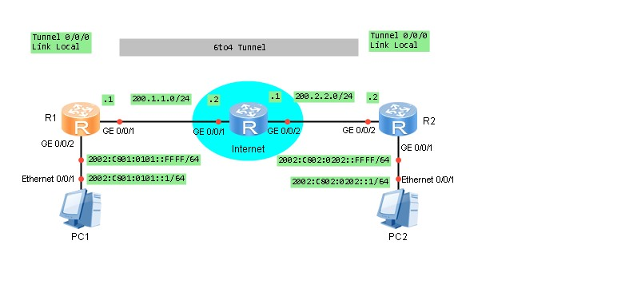
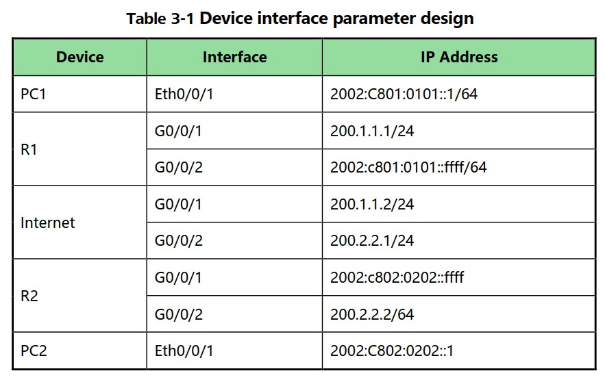
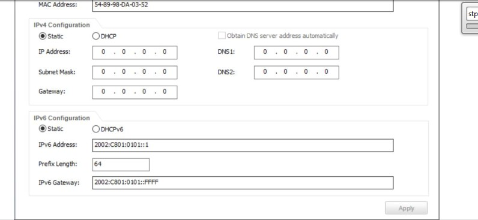

20210608

Задача:
Настроить IPv6 прохождение трафика в туннеле. Дизайн, Адресация - на картинке ниже.





Подзадачи:
1. Настройка IPv4 and IPv6 адресов на физических IF PC1, PC2, R1, R2, Internet. Сконфигурировать IPv4 статические маршруты, чтобы устройства виделись по IPv4. 
2. Настроить IPv6 адреса, IF, и tunnel mode в режиме 6to4 tunnel, сконфигурировать статику IPv6 и запустить 6to4 туннель. 

Как конфигурить IF на PC - ниже
PC1



PC2


проверка связности - ___ping___

```
system-view 
sysname R1
ipv6
 
### Настроим сразу IPv4 на outside и IPv6 на Inside
interface GigabitEthernet 0/0/1
ip address 200.1.1.1 24 
quit

interface GigabitEthernet0/0/2
ipv6 enable
ipv6 address 2002:C801:0101::FFFF/64
quit

### статика во вне IPv4
ip route-static 0.0.0.0 0.0.0.0 200.1.1.2


### 6to4 tunnel
interface Tunnel 0/0/0 
tunnel-protocol ipv6-ipv4 6to4 
ipv6 enable
source 200.1.1.1
ipv6 address auto link-local
quit

### статика IPv6 до Inside подсети R2
ipv6 route-static 2002:C802:0202:: 64 Tunnel 0/0/0
```

