20210616


Владислав Цуцков
Версия учебника ___HCIE-R&S Theory v3.0.pdf___ - 
Лабораторки ___Лабы LAB GUIDE 3.0___ - нормальные отзывы от преподавателя
Лабораторки ___Лабы HCIE-R&S+Theory+v1.1___ - Что-то рассмотрено блее подробно, чем в ver 3.0

Дп. материалы:
22 IPv6 Address Configuration.pdf
20 Introduction to IPv6.pdf
21 ICMPv6 and NDP.pdf

___Материал 3-го дня___ 
- OSPF (219-294 / 04:60:00 - 00:29:00)
  - Difference btw OSPFv3 and OSPFv2 (245-281 / 00:11:00 - 00:25:00)
  - OSPFv3 Config method and common Commanda (282-290 / 00:25:00 - 00:29:00)
  - Suggestion of OSPFv3 Exam prep (291-292 / Пролистали)

В HUAWEI - OSPFv3 только для IPv6. 

Автоматом RID не назначается, ___только manual___. Все вормирования соседства только под LLA.


- IS-IS (295-351 / 00:29:00 - 02:23:51)
  - Advanced IS-IS features (298-330 / 00:29:50 - 02:02:00)
     - доп. материал HCIE-R&S+Theory+v1.1.pdf (60-123 / упомянули вскользь 00:29:57 - 00:31:00)
     - IS-IS fast convergence  (299-305 / 00:32:00 - 01:06:26)
        - доп. материал на сайте HUAWEI (timer lsp-generation) 00:53:43 - 00:56:15
        - доп. материал на сайте HUAWEI (timer lsp-flooding) 00:58:49 - 00:59:00
        - доп. материал на сайте HUAWEI (timer spf) 01:00:24 - 01:01:30
     - IS-IS Administrative tag (306-309 / 01:06:30 - 01:10:00)
     - IS-IS LSP fragmentation (310-313 / 01:26:45 - 01:37:39)
        - доп. материал на сайте HUAWEI (IS-IS administrative tag) 01:26:57 - 01:27:20
        - доп. материал "01 Advanced IGP Features.pdf" (47 - 67 стр 62/ 01:28:00 - 01:29:00)
     - IS-IS route filtering (314-326 / 01:37:00 - 01:52:00)     
     - IS-IS route leaking (327-330 / 01:52:41 - 02:02:00)     
        - доп. материал "01 Advanced IGP Features.pdf" (47 - 67 стр 58/ 02:00:00 - 02:02:00)
  - Basic principles and Config of Ipv6 IS-IS (331-343 / 02:03:45 - 02:15:15)
     - IS-IS Proto extension (331-336 / 02:03:45 - 02:10:00)
     - IS-IS ST and MT (337-341 / 02:10:00 - 02:14:15)
        - Single totpology
        - Multi topology (включение ```ipv6 en topo ipv6```)
     - Ipv6 IS-IS Configuration  (342-343 / 02:14:45 - 02:15:15)
  - Application Cases of Dual Stack IS-IS (344-351 / 02:15:15 - 02:23:14)
     - доп. материал "HCIE-R&S+Theory+v1.1.pdf" (22 02:18:41)
- LAB GUIDE Л/Р 06 (OSPFv3+IS-IS) (74-101 / 02:23:14 - 02:23:34) 
- LAB GUIDE Л/Р 07 (IS-IS) (102-119 / 02:23:34 - 02:23:51) 

Доп Материал "1+Видео+урок+_Основы+протокола+IS-IS_fc770499-b7cd-4f6f-a3fe-3bfb40a6cc3b"

- BGP & BGP4+ (351-416 / 04:00:03 - 06:16:24)
  - BGP Fundamentals (356-378 / 04:00:00 - 05:01:00)
     - BGP Overview/Concepts (357-358 / 04:02:28 - 04:06:29)
     - BGP Implement (359-368 / 04:06:29 - 04:28:30)
        - Messages (04:06:29 - 04:13:45)
        - State Machine (04:13:45 - 04:19:00)
        - Databases  (04:19:33 - 04:19:50)
        - BGP Route Information Processing (04:19:50 - 04:24:00)
        - Interaction btw BGP & IGP (04:24:00 - 04:25:30)
        - Sync btw iBGP & IGP (04:25:30 - 04:28:30)
     - BGP Attributes (369-376 / 04:28:30 - 04:51:30)
     - BGP Route calc (377-378 / 04:51:30 - 05:01:00)     
  - BGP4+ Fundamentals (379-388 / 05:17:30 - 05:31:00)
     - доп. материал HUAWEI (05:17:55 - 05:19:40)
     - BGP4+ Overview (380-381 / 05:20:00 - 05:21:30)
     - BGP4+ Capabilities Advertisement (382-383 / 05:21:30 - 05:25:30)
     - Extended attributes BGP4+ (384-388 / 05:25:30 - 05:31:00)
  - Basic config BGP & BGP4+ (389-409 / 05:31:00 - 05:54:24)
  - BGP fault diag (410-415 / 05:54:24 - 06:06:24)
- LAB GUIDE Л/Р 08 (BGP) (121-144 / 06:06:30 - 06:16:24) 

Ключевые темы
## OSPFv3 окончание ##
Страницы 219 - 
Запись 00:14:00 - xxxx
Заучить нюансы по LSA OSPF v2, v3
### OSPF v2 04:57:37 - 06:01:46 ###
материалы по OSPF - 01 Advanced IGP Features.pdf


## IS-IS ##
Страницы 219 - 
Запись 00:14:00 - xxxx


Лаба 5 - сделать до Птн.

https://support.huawei.com/enterprise/en/doc/EDOC1100008283/2cb93101/flash-flood
https://support.huawei.com/enterprise/en/doc/EDOC1100008283/cc3ee1a8/timer-spf
https://support.huawei.com/enterprise/en/doc/EDOC1100116542/208eaf43/timer-lsp-generation
From BruceLee to Everyone:  11:13 AM
Q: а какие ссылки на все эти фичи в support.huawei.com? можете в чат написать?
A:https://support.huawei.com/hedex/hdx.do?docid=EDOC1100196170&lang=en&idPath=24030814%7C9856750%7C22715517%7C9858933%7C15837

https://support.huawei.com/enterprise/en/doc/EDOC1100038408?section=j09y&topicName=is-is-administrative-tag


После обеда: BGP


https://support.huawei.com/enterprise/en/doc/EDOC1100055099/70e83769/bgp-route-selection-rules


Л/Р 06, 07 - самостоятельно

Л/Р 8 - 
+
Д/З 2 (Z:\HOMEWORK)


## IS-IS ##
Доп. материал. 
1+Видео+урок+_Основы+протокола+IS-IS_fc770499-b7cd-4f6f-a3fe-3bfb40a6cc3b.mp4

Работает на Data Link Layer (L2)
PDU в следующем виде:
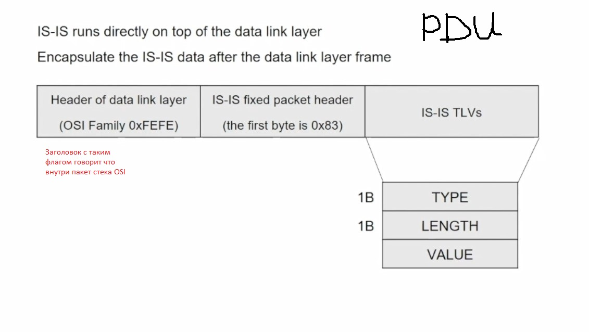

TLV - позволяет дополнять новыми определениями любой протокол, в частности IS-IS
- Type (1 byte) - что лежит в VALUE
- Length (1 byte) - длина в байтах, поля VALUE
- Value (XX byte) - само значение, которое пеедается в данном TLV

Термины IS-IS и похожие термины в OSPF: 
- ___IS___ Intermediate System (R);
- ___ES___ End System (host); 
- ___DIS___ Designated Intermediate System (DR); 
- ___SysID___ (RID); 
- ___PDU___;
- ___LSP___ (LSA); 
- ___NSAP___ (аналог IP); 
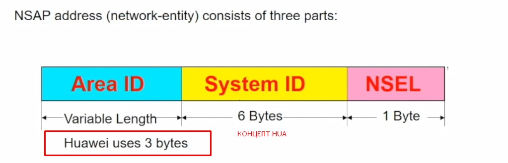
   - Area ID (3 bytes)
   - SysID (6 bytes, RID) Можно трансформировать из MAC или IP. 
      - ___49.___ - всегда
      - ___49.0021___ номер AREA - задаем после разбиения сети на AREA
      - IP каждый октет добиваем спереди нулями до 3-значного вида и ставим ___.___ после каждой группы из 4 цифр
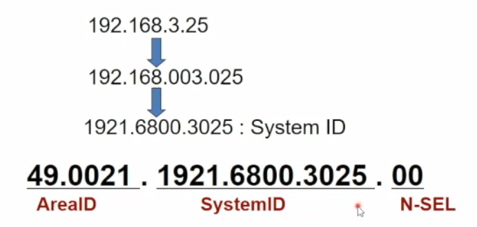
   - NSEL (аналог NCP/UDP, заполняем нулями)
      - ___00___
- ___NET___ - спец NSAP адрес, с интегрированным SysID+№ области
- ___IIH___ - Is-Is Hello
- ___PSNP___ - Partial Seq Num Packet (ack или LSR в OSPF)
- ___CSNP___ - аналог DD, база данных соотв.области

Архитектура - иерархическая. Если в типе маршрутизатора есть L2, то он принадлежит BB. L1 не может соединять L1L2

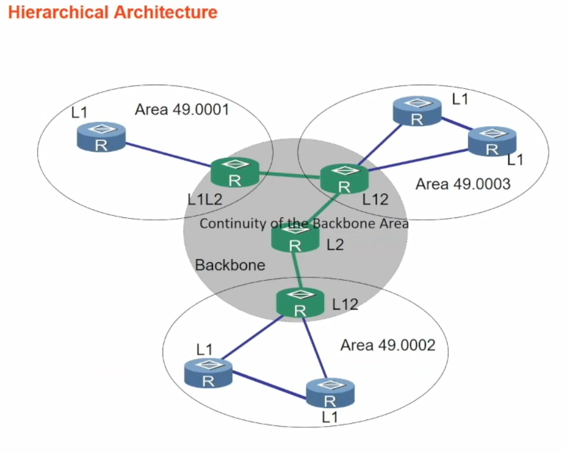

- L1 = STUB - знает топологию только конкретной области. Не имеет маршрутов в другие Area, кроме default, через nexthop L1L2 приславшего ему определенный LSP.
- L2 = BackBONE
   - формирует соседство для составления DB магистралей. 
   - Знает о всех сетях из L1, подключенные через L1L2.
- L1L2 - аналог ABR, распространят маршруты STUB -> BB. Формирует DB backbone. 
   - генерит определенный бит Attachment, и если он содержит единицу, то LSP создано R типа L1L2, то есть тем, кто имеет доступ к BB
   - объединяет оба типа зон
   - имеет 2DB
      - внутренняя DB Area
      - все сети домена IS-IS

Говоря про сосдство, учитывают тип R:
- Соседство Level-1 
   - между L1L2<->L1
- Соседство Level-1-2 (по сути на рис. ниже должно быть 2 стрелки, 2 независимых соседства)
   - между L1L2<->L1L2 в одной Area
- Соседство Level-2 
   - между L1L2<->L2 в BB
   - между L1L2<->L1L2 в разных Area

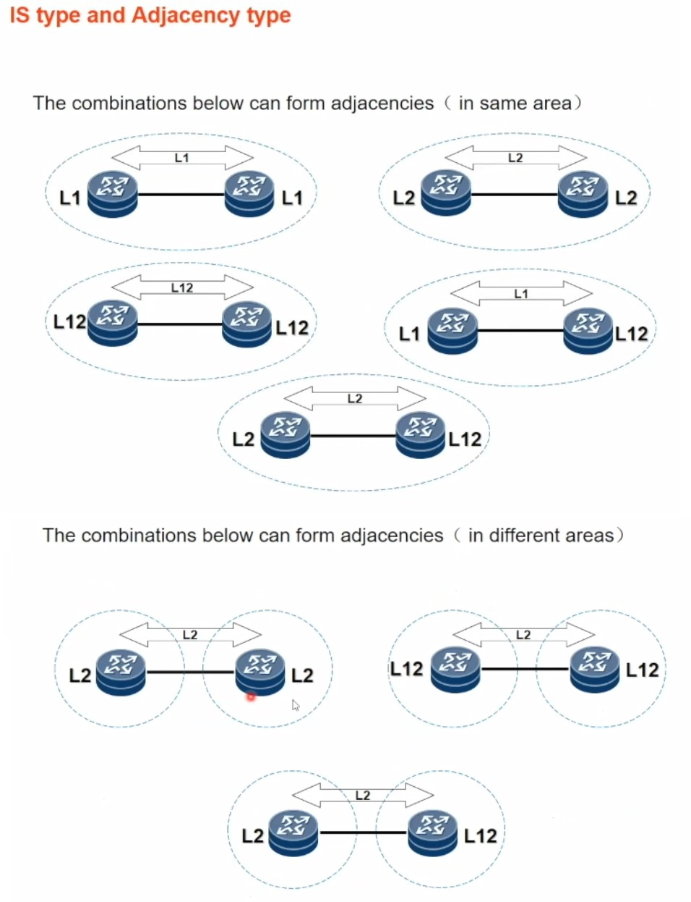

Пример топологии. Видно как BB частично заходит в STUB и понятно откуда L1L2 имеет 2 DB

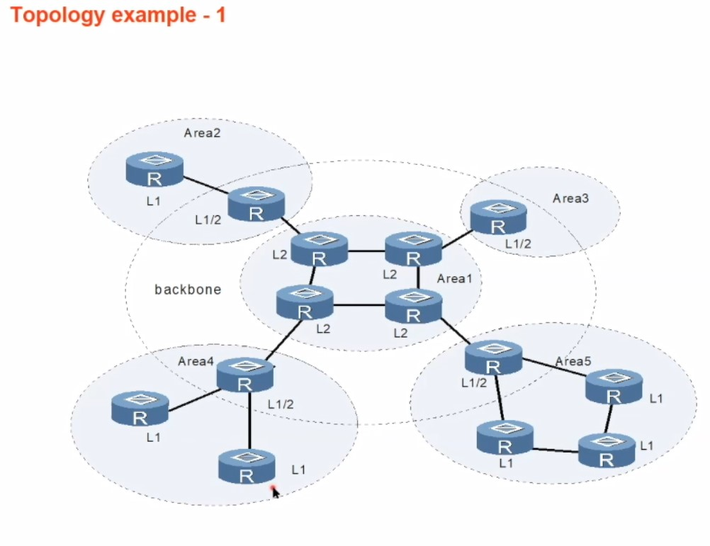

Принцип работы
- обнаружение и установка Adjasency
   - p-t-p или BC; Не поддерживаются NBMA
   - соседство мождет быть установлено только по принципам описанным в типах соседства
   - L1 - ___49.0021___ номер AREA должны быть одинаковы
   - IP-связность в одной сети
- синхронизация BD сетей (LSP-Flooding)
- Вычисление кратчайшего маршрута (Дейкстра) - на выходе - таблица маршрутизации

Типы пакетов (00:25)
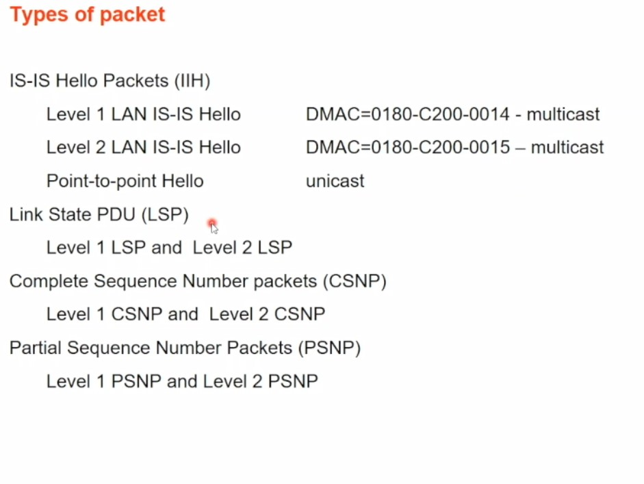

Формирование связности (00:28) - Подтвеждения получения пакета нет

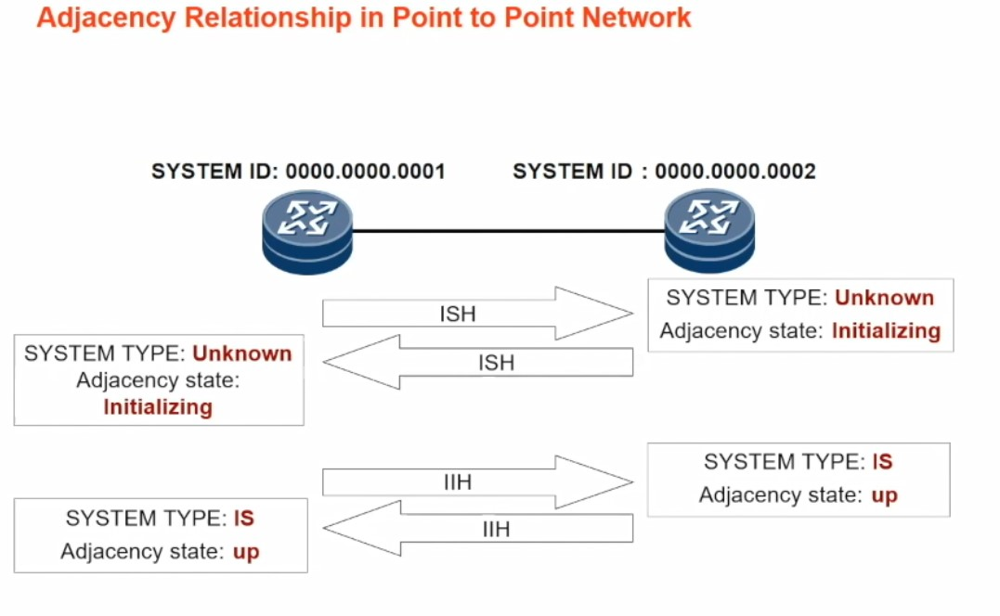

- ISH
- IIH
   - проверяется max число адресов в области 
   - длина SysID (по-умолчанию 0)
   - AreaID 
      - должна совпадать, если R типа L1 в одной AREA.
      - Не существенна для L2
   - Аутентификация/хэши
   - Ip-сеть одинакова, требуется отключения

Соседство в BC линках - в 3 этапа

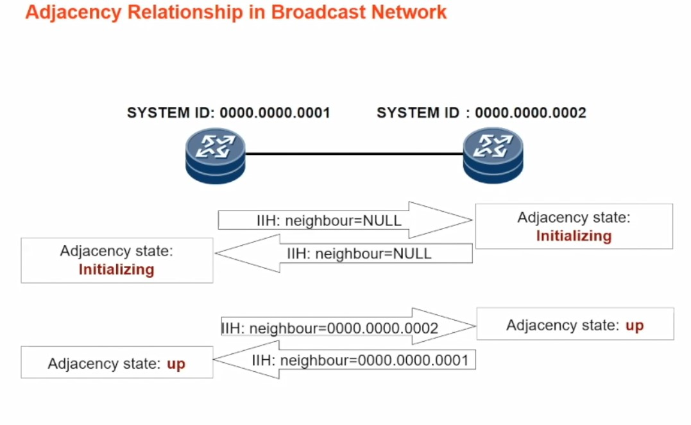

В BC-среде, выбирается 1 и делается  ___DIS___, некий relay, который 
- рассылает обновления
- генерирует псевдоноды LSP, упрощение расчета Дейкстры
- по-умолчани priority 64 и конкуренцию выигрывает тот, у кого MAC - больше, или меняем приоритет, и выиграет тот, у кого больше

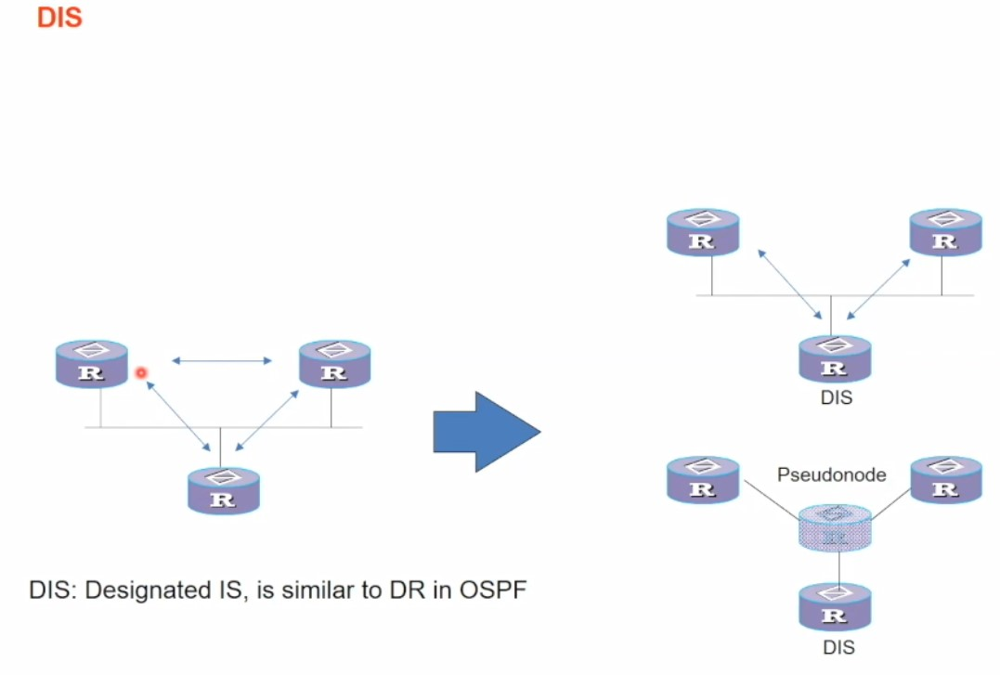

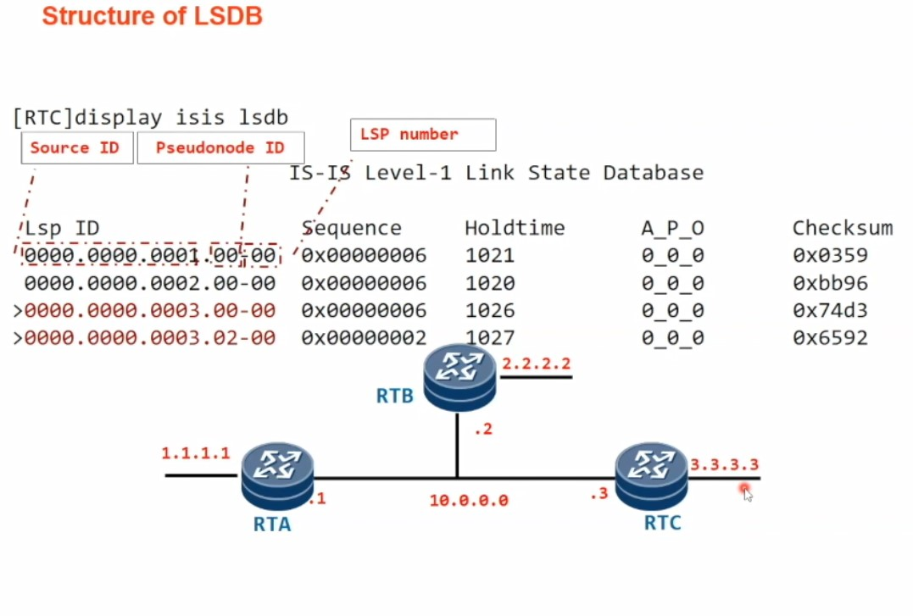

___Рут ликинг___ - борьба с субоптимальными путями, когда их больше одного, на выходе из STUB. Разрешается передача маршрутов из BB в L1 -область.
   - специальная команда
   - маршруты BB распространяются по Stub
   - увеличен объем DB в STUB-роутерах

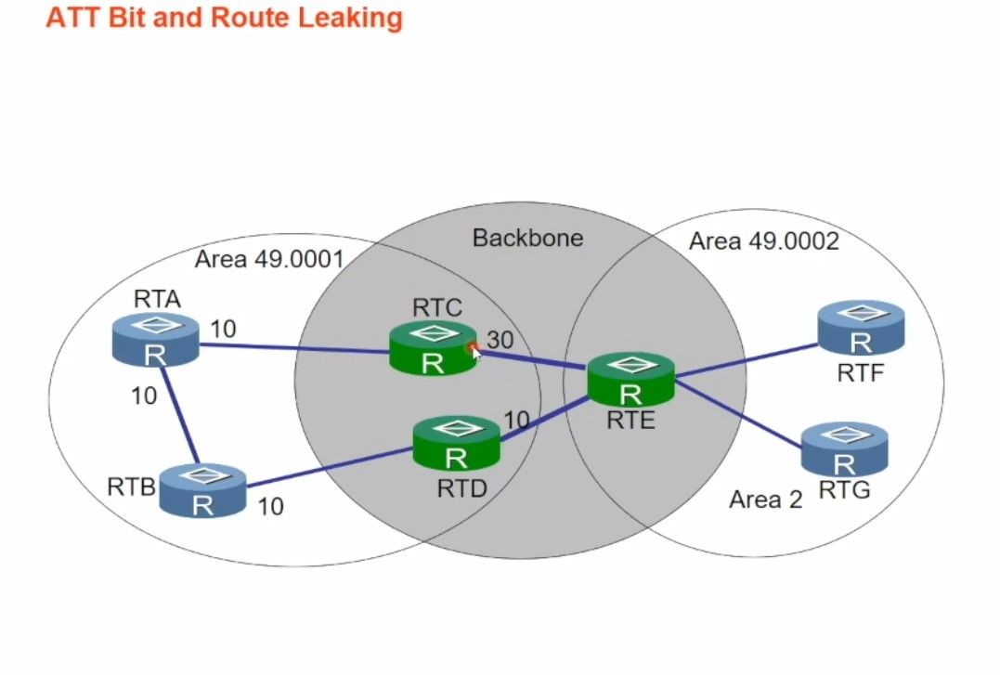