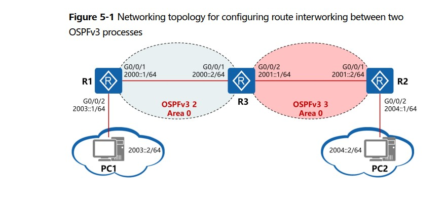
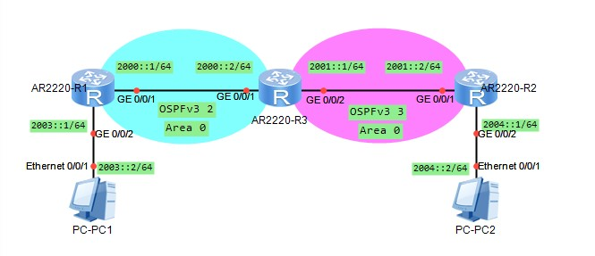
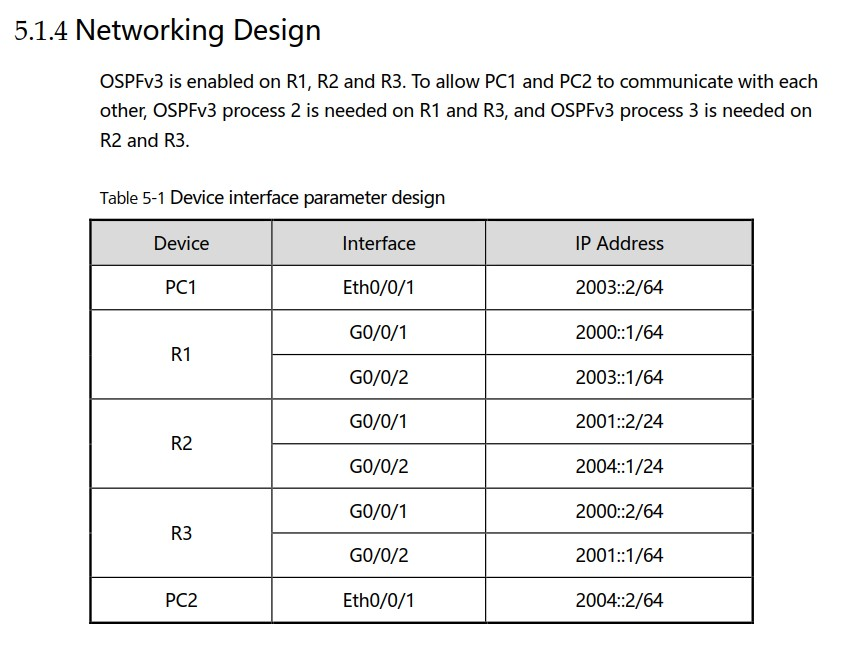

20210616
Лабораторки 05, 06, 07

___ЛР05___
стр. 63 HCIE-R&S+Lab+Guide+v3.0.pdf

Дизайн, Адресация - на картинках ниже.






## ЗАДАНИЕ ##
1. Настроить IPv6 на узлах PC1, PC2, R1, R2 и R3: на L3 линкАх должна появиться связность IPv6. 
2. Настроить OSPFv3 процесс 2 на R1 и R3, а также OSPFv3 процесс 3 для R2 и R3. 
3. на R3, настроить импорт маршрутов OSPFv3 процессов для того, чтобы PC1 мог связаться с PC2. 

## Решение ##

Конфиги для R1, R2, R3- банальны и практически совпадают, различиется лишь настройка соответствующего процесса OSPF

Настройка IPv6

```
Сброс
reset saved-config

Группа портов
port-group ITPorts
group-member gi x/x/x to gi y/y/y


system-view 
sysname R1
ipv6
 
### Настроим сразу IPv6 на Outside и Inside
interface GigabitEthernet0/0/2
ipv6 enable
ipv6 address 2003::1 64
quit

interface GigabitEthernet 0/0/1
ipv6 enable
ipv6 address 2000::1 64 
quit
```

Настройка OSPFv3 - лучше, чем у старой версии v2, где надо адвертайзить сети

```
### OSPFv3 2
ospfv3 2
router-id 10.10.10.10
quit

### включаем OSPFv3 2 на IF
interface GigabitEthernet0/0/1
ospfv3 2 area 0
quit

### импортируем коннектед маршруты
ospfv3 2
import-route direct
quit
```

Настройка OSPFv3 и редистрибуция маршрутов из разных процессов на R3
```
### OSPFv3 2
ospfv3 2
router-id 31.31.31.31
quit

### OSPFv3 3
ospfv3 3
router-id 32.32.32.32
quit

### включаем OSPFv3 2 на IF
interface GigabitEthernet0/0/1
ospfv3 2 area 0
quit

### включаем OSPFv3 3 на IF
interface GigabitEthernet0/0/2
ospfv3 3 area 0
quit

### импортируем маршруты из ospf второго Process-ID
ospfv3 2
import-route ospfv3 3
quit

ospfv3 3
import-route ospfv3 2
quit
```
Конфиги по задаче тут: [R1](config/L4/R1.txt), [R2](config/L4/R2.txt), [R3](config/L4/R3.txt)


___ЛР06___

стр. 14 HCIE-R&S+Lab+Guide+v3.0.pdf
Дизайн, Адресация - на картинках ниже.


## ЗАДАНИЕ ##
1. Настроить IPv6 на узлах PC1, PC2, R1, R2 и R3: на L3 линкАх должна появиться связность IPv6. 
2. Настроить OSPFv3 процесс 2 на R1 и R3, а также OSPFv3 процесс 3 для R2 и R3. 
3. на R3, настроить импорт маршрутов OSPFv3 процессов для того, чтобы PC1 мог связаться с PC2. 

## Решение ##

Конфиги по задаче тут: [R1](config/L4/R1.txt), [R2](config/L4/R2.txt), [R3](config/L4/R3.txt)