20210619

Оглавление HCIE-R&S+Lab+Guide+v3.0.pdf - стр. 05

Лабораторки 05, 06, 07

___ЛР08___
стр. 120 HCIE-R&S+Lab+Guide+v3.0.pdf

Дизайн, Адресация - на картинках ниже.

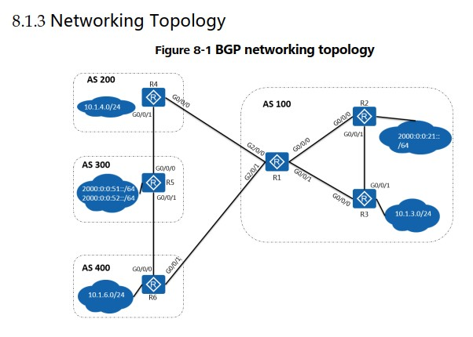
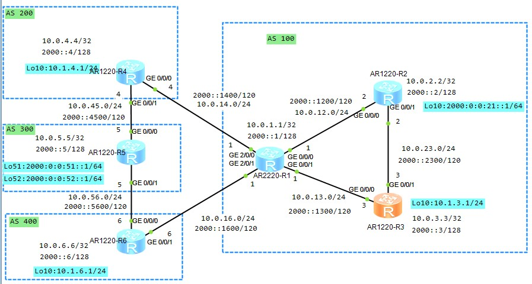

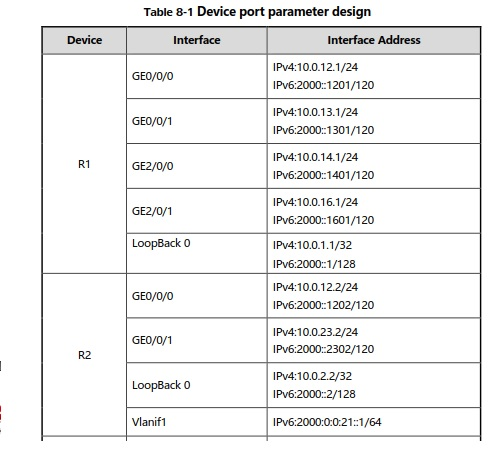
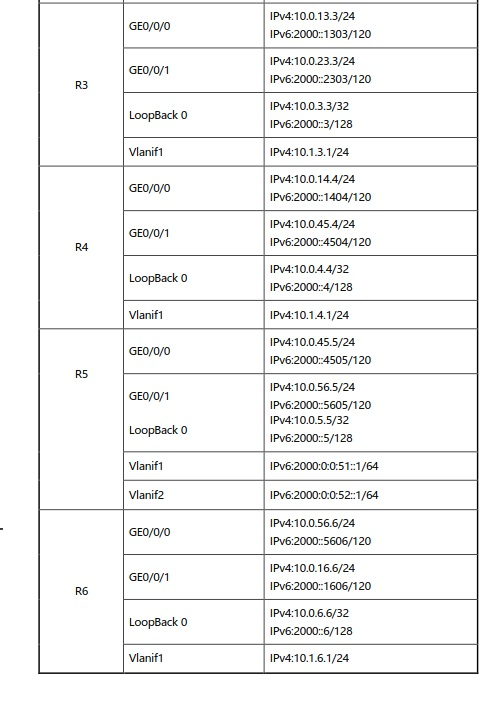

## ЗАДАНИЕ ##
1. Назначим IPv4 и IPv6 на все IF устройств. 
2. Используем OSPFv2 и OSPFv3 как IGP в AS 100
   - на IF настраиваем только ospfv3
   - в ospfv2 публикуем подсети, включая IF lo0
3. Для всех AS настроить пиринг IBGP или EBGP между устройствами с общим линкОм. Исползовать IP addresses IF loopback в качестве update source для установки IBGP пиринга в AS 100. R1 и R4 также должны использовать loopback IF для установки  EBGP пиринга с использованием статических маршрутов. (настройка IPv6 BGP пиринга такая же.) Не забываем про необходимость включения IPv4/IPv6 контекстов.
4. Разослать все сети (Ipv4, IPv6) всех IF loopback 0 и добиться того, чтобы все  loopback IF топологии BGP  имели связность друг с другом. 
5. Отфильтруйте маршруты. AS 100 не должна рассылать маршруты о которых она узнавала от AS 400 и рассылала на AS200. 
6. Выбор маршрутов: Роутеры в AS 100 предпочитают ___paths passing___ через AS 200 для доступа к 2000:0:0:51::1/64, и выбирают ___paths passing___ через AS 400 к 2000:0:0:51::2/64. 

## Решение ##

R1 перед фильтрацией маршрутов от AS 400
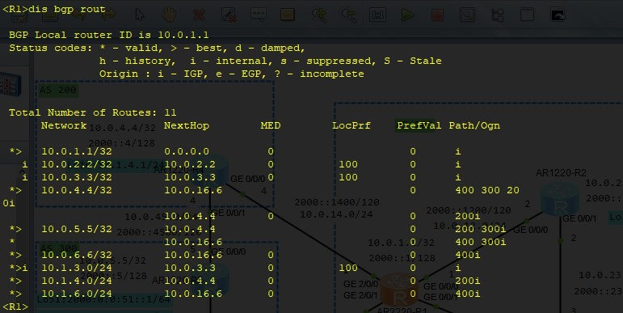

AS200 - R4 до и после фильтрации маршрутов от AS 400, которые рассылались через AS 100

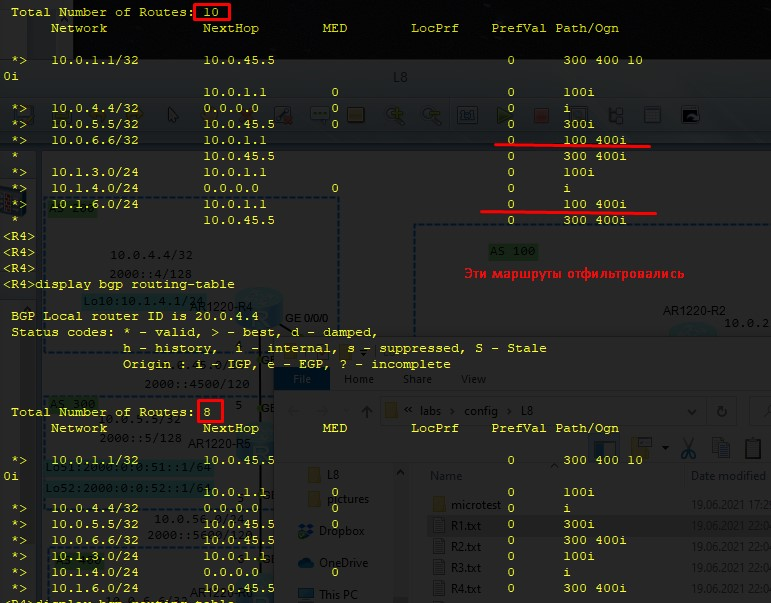

AS300 - R5 до и после фильтрации маршрутов от AS 400, которые рассылались через AS 100

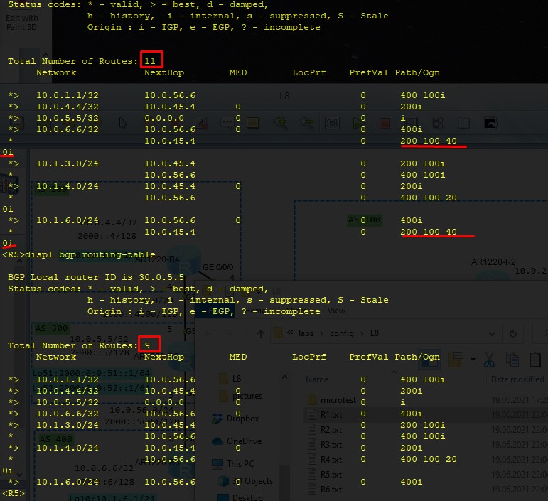

AS400 - R6 до и после фильтрации маршрутов от AS 200, которые рассылались через AS 100


Маршруты в подсетки ipv6 до и после задания предпочтительного AS-PATH (увеличили вес при импорте от 2000::4)

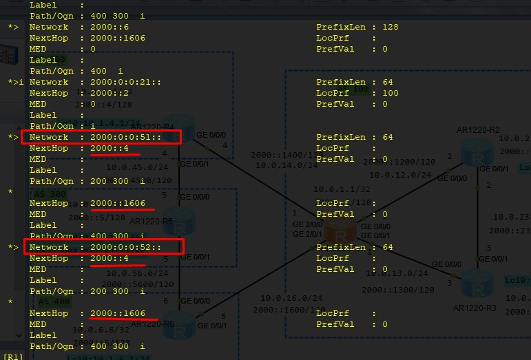
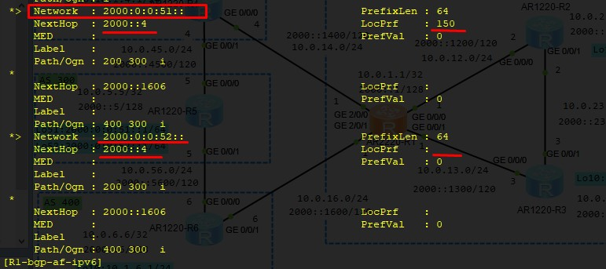
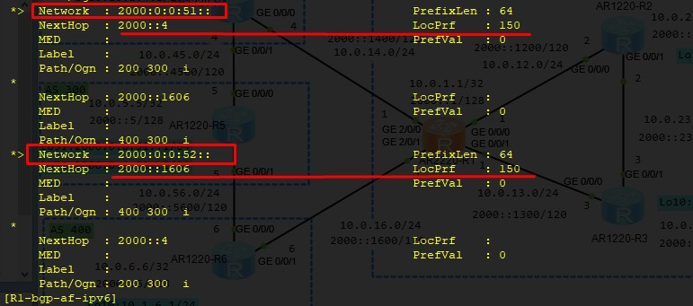

проверка tracdert с R3
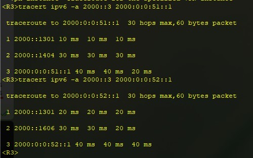


Конфиги по задаче тут: 
[R1](config/L8/R1.txt), 
[R2](config/L8/R2.txt), 
[R3](config/L8/R3.txt), 
[R4](config/L8/R3.txt), 
[R5](config/L8/R3.txt), 
[R6](config/L8/R3.txt)


___ЛР06___

стр. 74 HCIE-R&S+Lab+Guide+v3.0.pdf
Дизайн, Адресация - на картинках ниже.


## ЗАДАНИЕ ##
1. Вклдчить OSPFv3 1 на R1, R2, R3, R4 and R5. 
2. Area 0 (R1 и R2), Area 2 (R1 и R3), Area 1 (R1 и R5), а  Area 3 (R2 и R4). После установки OSPFv3 - соседства,  R1, R2, 
R3, R4 и R5 будут иметь Ipv6-связность. 
3. Включить IS-ISv6 на R5, R6 и R7. Задать уровень IS-IS R5 и R6 равным Level-1-2, а для R7 - Level-1. После установки соседства IS-IS , R5, R6 и R7 будут иметь Ipv6-связность. 
4. На R5, сконфигурировать передачу маршрутов [route redistribution] из OSPFv3 в IS-ISv6 и наоборот (IS-ISv6 в  OSPFv3). Настроить фильтрация импортируемых маршрутов на R5 так, чтобы предотвратить доступ из R&D Dept. 2 (слева) в сегменты справа  Marketing Dept. 1 и R&D Dept. 1, and After-Sales Service Dept. 
5. Отфильтровать маршруты на R3 так чтобы Marketing Dept. 1 не мог попасть в сегмент R&D Dept. 1. 
6. Отфильтровать маршруты на R4 так чтобы R&D Dept. 1 и  After-sales Service Dept. (справа) не имели доступ в сегмент  Marketing Department 2 (слева).

## Решение ##

Конфиги по задаче тут: 
[R1](config/L6/R1.txt), [R2](config/L6/R2.txt), [R3](config/L6/R3.txt), [R4](config/L6/R4.txt), [R5](config/L6/R5.txt), [R6](config/L6/R6.txt), [R7](config/L6/R7.txt)


___ЛР07___

стр. 102 HCIE-R&S+Lab+Guide+v3.0.pdf
Дизайн, Адресация - на картинках ниже.


## ЗАДАНИЕ ##
1. Dual IS-IS runs on RTA, RTB, RTC and RTD. 
- Area 02 (RTA - Level-2 router);
- Area 01 (RTB - Level-1-2, RTC - Level-1-2 and RTD - Level-1 )
2. The four routers need to communicate with each other through both IPv4 and IPv6 routes. 
3. IS-IS route leaking is configured on RTB and RTC. Route Leaking — маршруты протекают из IS-IS в глобальную таблицу. Название функционала говорящее — прибегать к Route Leaking'у, особенно через статические маршруты, нужно только в крайних случаях, ибо жуткий костыль.
4. Есть 2 маршрута в таблице маршрутизации RTA: 100.1.1.1/32 and 200.1.1.1/32. Надо настроить политику чтобы разрешить RTA рассылать только маршрут 200.1.1.1/32.

Выполнение задания надо выполнить в седующем порядке


## Решение ##

IS-IS route leaking 
```
import-route isis level-2 into level-1
```

Уже после сдачи понял где ошибся в лабе, так как вообще ну дружу с IS-IS
```
isis 1
 ipv6 enable topology ipv6 - а я не знаю пока чем эта команда отличается от дефолтного standard
```
Конфиг RTA для рассылки только маршрута 200
```
### Задаем 2 маршрута, чтобы затем через фильтрацию из них вбросить только 1 
ip route-static 100.1.1.1 255.255.255.255 NULL0 
ip route-static 200.1.1.1 255.255.255.255 NULL0 

### Configure the routing policy on RTA.
ip ip-prefix 200 index 10 permit 200.1.1.1 32 
route-policy 200 permit node 10 
 if-match ip-prefix 200 

isis 1 
 import-route static route-policy 200 
```

Конфиги по задаче тут: [RTA](config/L7/RTA.txt), [RTB](config/L7/RTB.txt), [RTC](config/L7/RTC.txt), [RTD](config/L7/RTD.txt)

