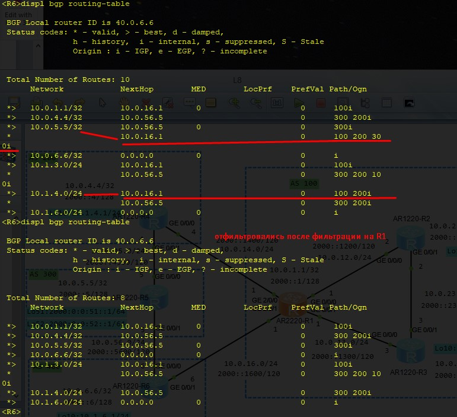

20210619

Оглавление HCIE-R&S+Lab+Guide+v3.0.pdf - стр. 05

Лабораторки 08, 09,  10

___ЛР08___
стр. 120 HCIE-R&S+Lab+Guide+v3.0.pdf

Дизайн, Адресация - на картинках ниже.


## ЗАДАНИЕ ##
1. Назначим IPv4 и IPv6 на все IF устройств. 
2. Используем OSPFv2 и OSPFv3 как IGP в AS 100
   - на IF настраиваем только ospfv3
   - в ospfv2 публикуем подсети, включая IF lo0
3. Для всех AS настроить пиринг IBGP или EBGP между устройствами с общим линкОм. Использовать IP addresses IF loopback в качестве update source для установки IBGP пиринга в AS 100. R1 и R4 также должны использовать loopback IF для установки  EBGP пиринга с использованием статических маршрутов. (настройка IPv6 BGP пиринга такая же.) Не забываем про необходимость включения IPv4/IPv6 контекстов.
4. Разослать все сети (Ipv4, IPv6) всех IF loopback 0 и добиться того, чтобы все  loopback IF топологии BGP  имели связность друг с другом. 
5. Отфильтруйте маршруты. AS 100 не должна рассылать маршруты о которых она узнавала от AS 400 и рассылала на AS200. 
6. Выбор маршрутов: Роутеры в AS 100 предпочитают ___paths passing___ через AS 200 для доступа к 2000:0:0:51::1/64, и выбирают ___paths passing___ через AS 400 к 2000:0:0:51::2/64. 

## Решение ##

R1 перед фильтрацией маршрутов от AS 400


AS200 - R4 до и после фильтрации маршрутов от AS 400, которые рассылались через AS 100


AS300 - R5 до и после фильтрации маршрутов от AS 400, которые рассылались через AS 100


AS400 - R6 до и после фильтрации маршрутов от AS 200, которые рассылались через AS 100



Маршруты в подсетки ipv6 до и после задания предпочтительного AS-PATH (увеличили вес при импорте от 2000::4)


проверка tracdert с R3


Конфиги по задаче тут: [R1](config/L8/R1.txt), [R2](config/L8/R2.txt), [R3](config/L8/R3.txt), [R4](config/L8/R3.txt), [R5](config/L8/R3.txt), [R6](config/L8/R3.txt)


___ЛР09___

стр. 145 HCIE-R&S+Lab+Guide+v3.0.pdf
Дизайн, Адресация - на картинках ниже.


## ЗАДАНИЕ ##
The configuration roadmap is as follows: 
1. Назначить IPv4 и IPv6 на IF каждого хоста. 
2. Используйте OSPFv2 и OSPFv3 как IGP в AS 100. 
3. Настройте IBGP или EBGP пиринг между накоротко скоммутированными устройствами. Используйте Lo IF для iBGP пиринга и физические IF для eBGP пиринга. Настройте egress/бордер роутеры R4 и R5 в AS 100 на аутентификацию eBGP пиров. 
4. Настройте R2 и R3 как RRs для R4 и R5 соответственно, а их самих - клиентами R1. 
5. Настройте все устройства на рассылку маршрутов всех directly connected сетевых сегментов в BGP. AS 200 и AS 400 принадлежат разным ISPs, а сети 221.12.128.1/24 и 115.192.0.0/24 за R1, принадлежат этим ISPs соответственно. В этой ситуации, чтобы разрешить пользователям подсетей ISP доступ к серверам соответствующих сетей ISP, необходимо обеспечить выполнение следующих условий: 
   - 1. маршрут до 221.12.128.1/24 расспространяется только на AS 200. 
   - 2. маршрут до 115.192.0.0/24 расспространяется только на AS 400. 
Дополнительно, для предотвращения трафика между ISPs через AS 100, устройства AS 100 могут знать о маршрутах AS 200 и AS 400 но рассылка этих маршрутов в соответствующие AS 400 и AS 200 - запрещена. (Это ограничение касается только IPv4). Эти ограничение следует реализовать используя атрибут community. 
6. Разрешить устройствам из AS 100 доступ к 4 сегментам сети: 2000:0:0:70:: /64, 2000:0:0:71:: /64, 2000:0:0:72:: /64, and 2000:0:0:73:: /64. Дополнительно, надо обеспечить защиту от сетевых петель (network loops) и максимально минимизировать влияние flapping-а сетевых сегментов на всю сеть. 
7. Настроить эффективное использование BW, когда R1 трафик идет в сегмент 10.1.7.0/24 через сегмент 10.1.1.0/24, долна быть сконфигурирована отказоустойчивость линков на R1. 


## Решение ##

Настройка типового конфига IPv4, IPv6, OSPFv2, OSPFv3

```
system-view 
sysname R1
ipv6
 
### Настроим сразу IPv4 и IPv6
interface GigabitEthernet0/0/0
ip addr 10.0.12.1 24
ipv6 enable
ipv6 address 2000::1201 120
quit

interface GigabitEthernet 0/0/1
ip addr 10.0.13.1 24
ipv6 enable
ipv6 address 2000::1301 120 
quit

interface lo0
ip addr 10.0.1.1 32
ipv6 enable
ipv6 address 2000::1 128 
quit

interface lo11
ip addr 221.12.128.1 24
quit

interface lo12
ip addr 115.192.0.1 24
quit

interface lo13
ip addr 10.1.1.1 24
ipv6 enable
ipv6 address 2000:0:0:11::1 64
quit


### включаем OSPF2
router-id 10.0.1.1
ospf 1 router-id 10.1.1.1 
 area 0.0.0.0 
netw 10.0.12.0 0.0.0.255
netw 10.0.13.0 0.0.0.255
netw 10.0.1.1 0.0.0.0
quit

### OSPFv3 1
ospfv3 1
router-id 10.0.1.1
quit

### включаем OSPFv3 1 на IF
interface GigabitEthernet0/0/0
ospfv3 1 area 0
quit

interface GigabitEthernet0/0/1
ospfv3 1 area 0
quit

interface LoopBack0
ospfv3 1 area 0
quit

```
Проверка 
```
display ip routing-table protocol ospf
display ospfv3 peer 
```

Настройка iBGP с IF Lo0
```
### R1
bgp 100
router-id 10.0.1.1
peer 10.0.2.2 as-number 100
peer 10.0.2.2 connect-interface LoopBack0 
...
peer 2000::2 as-number 100
peer 2000::2 connect-interface LoopBack0
...
 ipv4-family unicast 
 undo synchronization 
 peer 10.0.2.2 enable 
...
 ipv6-family unicast
 undo synchronization
 peer 2000::2 enable
...
quit
```


Настройка eBGP - с аутентификацией ( делается с двух сторон)
```
### R4
bgp 100
peer 10.0.46.6 as-number 200
peer 10.0.46.6 password cipher huawei
peer 2000::4606 as-number 200
peer 2000::4606 password cipher huawei

 ipv4-family unicast 
 undo synchronization 
 peer 10.0.46.6 enable 

 ipv6-family unicast
 undo synchronization
 peer 2000::4606 enable
quit

### R6 - ответка
bgp 200
peer 10.0.46.4 as-number 100
peer 10.0.46.4 password cipher huawei
peer 2000::4604 as-number 100
peer 2000::4604 password cipher huawei
...
 ipv4-family unicast 
 undo synchronization 
 peer 10.0.46.4 enable
...
 ipv6-family unicast
 undo synchronization
 peer 2000::4604 enable
...
quit
```

Натравливаем RR на нижестоящих пиров, схема получается ниспадающей, проверка ```display bgp peer 10.0.2.2 verbose | in reflec```
```
bgp 100
ipv4-family unicast
 peer 10.0.2.2 reflect-client 
 peer 10.0.3.3 reflect-client 

ipv6-family unicast 
 peer 2000::2 reflect-client 
 peer 2000::3 reflect-client 
quit 

```


Опоздал со сдачей


Конфиги по задаче тут: 
[R1](config/L9/R1.txt), [R2](config/L9/R2.txt), [R3](config/L9/R3.txt), [R4](config/L9/R4.txt), [R5](config/L9/R5.txt), [R6](config/L6/R9.txt), [R7](config/L9/R7.txt), [R8](config/L9/R8.txt), [R9](config/L9/R9.txt)


___ЛР10___

стр. 184 HCIE-R&S+Lab+Guide+v3.0.pdf
Дизайн, Адресация - на картинках ниже.


## ЗАДАНИЕ ##
The configuration roadmap is as follows: 
1. Назначить IPv4 и IPv6 на IF каждого хоста. 
2. Используйте OSPFv2 и OSPFv3 как IGP в AS 100. 
3. Настройте IBGP или EBGP пиринг между накоротко скоммутированными устройствами. Используйте Lo IF для iBGP пиринга и физические IF для eBGP пиринга. Настройте egress/бордер роутеры R4 и R5 в AS 100 на аутентификацию eBGP пиров. 
4. Настройте R2 и R3 как RRs для R4 и R5 соответственно, а их самих - клиентами R1. 
5. Настройте все устройства на рассылку маршрутов всех directly connected сетевых сегментов в BGP. AS 200 и AS 400 принадлежат разным ISPs, а сети 221.12.128.1/24 и 115.192.0.0/24 за R1, принадлежат этим ISPs соответственно. В этой ситуации, чтобы разрешить пользователям подсетей ISP доступ к серверам соответствующих сетей ISP, необходимо обеспечить выполнение следующих условий: 
   - 1. маршрут до 221.12.128.1/24 расспространяется только на AS 200. 
   - 2. маршрут до 115.192.0.0/24 расспространяется только на AS 400. 
Дополнительно, для предотвращения трафика между ISPs через AS 100, устройства AS 100 могут знать о маршрутах AS 200 и AS 400 но рассылка этих маршрутов в соответствующие AS 400 и AS 200 - запрещена. (Это ограничение касается только IPv4). Эти ограничение следует реализовать используя атрибут community. 
6. Разрешить устройствам из AS 100 доступ к 4 сегментам сети: 2000:0:0:70:: /64, 2000:0:0:71:: /64, 2000:0:0:72:: /64, and 2000:0:0:73:: /64. Дополнительно, надо обеспечить защиту от сетевых петель (network loops) и максимально минимизировать влияние flapping-а сетевых сегментов на всю сеть. 
7. Настроить эффективное использование BW, когда R1 трафик идет в сегмент 10.1.7.0/24 через сегмент 10.1.1.0/24, долна быть сконфигурирована отказоустойчивость линков на R1. 


## Решение ##

Опоздал со сдачей


Конфиги по задаче тут: 
[R1](config/L9/R1.txt), [R2](config/L9/R2.txt), [R3](config/L9/R3.txt), [R4](config/L9/R4.txt), [R5](config/L9/R5.txt), [R6](config/L6/R9.txt), [R7](config/L9/R7.txt), [R8](config/L9/R8.txt), [R9](config/L9/R9.txt)

