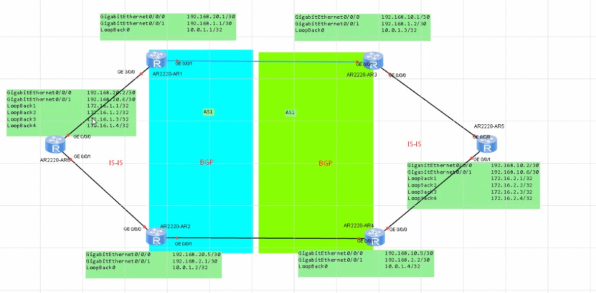

___Материал 6-го дня___ 

Доп. материалы
HCIE-R&S+Theory+v1.1.pdf

- Мультикастинг (563-593)
  - MLD Overview (567-568 / 0X:XX:00 - 0X:XX:00)
  - MLD v1 (570-YY / 0X:XX:00 - 0X:XX:00)
     - Group Member Join (XX-YY / 0X:XX:00 - 0X:XX:00)
     - Group Member Leave (XX-YY / 0X:XX:00 - 0X:XX:00)
     - III (XX-YY / 0X:XX:00 - 0X:XX:00)
  - MLD v2 (575-YY / 0X:XX:00 - 0X:XX:00)
     - MLD Query Mess Format (576-YY / 0X:XX:00 - 0X:XX:00)
     - III (XX-YY / 0X:XX:00 - 0X:XX:00)
     - III (XX-YY / 0X:XX:00 - 0X:XX:00)
  - SSM Mapping (585-593 / 0X:XX:00 - 0X:XX:00)
     - III (XX-YY / 0X:XX:00 - 0X:XX:00)
     - III (XX-YY / 0X:XX:00 - 0X:XX:00)
     - III (XX-YY / 0X:XX:00 - 0X:XX:00)

- PIM (596-)
  - PIM-SM Mechanism Overview (597-600 / 0X:XX:00 - 0X:XX:00)
  - IPv6 PIM-SM [sparse mode] Config (601-YY / 0X:XX:00 - 0X:XX:00)

 LAB GUIDE Л/Р 11 (201 - XX / 06:40:45 - 07:19:12) 

  - IPv6 PIM-SSM Fundam (575-YY / 0X:XX:00 - 0X:XX:00)
     - MLD Query Mess Format (576-YY / 0X:XX:00 - 0X:XX:00)
     - III (XX-YY / 0X:XX:00 - 0X:XX:00)
     - III (XX-YY / 0X:XX:00 - 0X:XX:00)
  - Multicast Route Mechanism (585-593 / 0X:XX:00 - 0X:XX:00)
     - III (XX-YY / 0X:XX:00 - 0X:XX:00)
     - III (XX-YY / 0X:XX:00 - 0X:XX:00)
     - III (XX-YY / 0X:XX:00 - 0X:XX:00)
  - Typical IPv6 Multicast APP (585-593 / 0X:XX:00 - 0X:XX:00)
     - III (XX-YY / 0X:XX:00 - 0X:XX:00)
     - III (XX-YY / 0X:XX:00 - 0X:XX:00)
     - III (XX-YY / 0X:XX:00 - 0X:XX:00)

https://support.huawei.com/enterprise/en/doc/EDOC1000091883/955ce715/what-flags-are-commonly-used-in-a-pim-routing-table

ДЗ 3-й недели, состояит из 3 заданий (есть видео в конце 6-го дня):
- 1-е задание PLS, MPLS_VPN - по Lab GUIDE
- 2-е задание стык из OSPF+IS-IS
   - 1,2 - configured
   - 3 - 
   - 4 - главный путь: взаимная редистрибуция для префиксов со 172.16
      - cost - метрика должна наследоваться при редистрибуции
      - Lo0 - по оптимальном у пути (10-я лаба)
- 3-е Задание: Часть оборудования преднастроена
   - сделать матчинг по октету (чет-нечет)
   - добиться при обращении к lo R5 разнесения маршрутов:
      - до нечетных Lo - через верх
      - до четных Lo - через низ

Корректная схема
 

