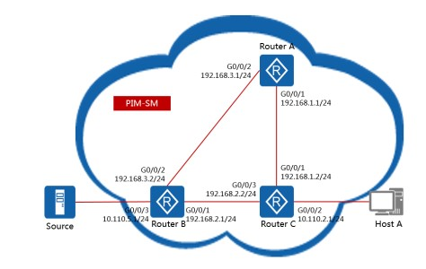
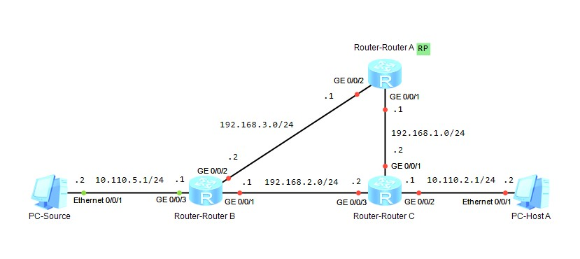
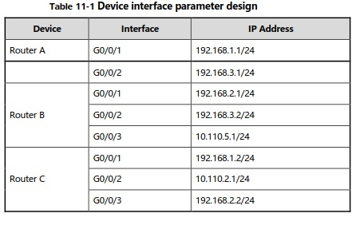
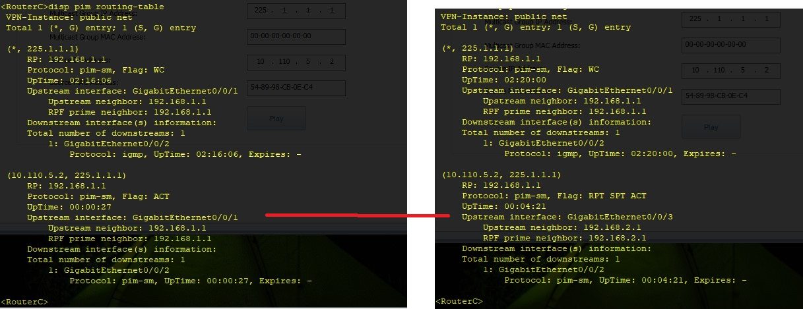

20210619

Оглавление HCIE-R&S+Lab+Guide+v3.0.pdf - стр. 05

Лабораторки 11

___ЛР11___
стр. 202 HCIE-R&S+Lab+Guide+v3.0.pdf

Дизайн, Адресация - на картинках ниже.






## ЗАДАНИЕ ##
1. Настроить IP на всех IF R и сконфигурировать unicast routing протокол. 
2. Включить multicast на всех роутерах, PIM-SM на каждом IF, и IGMP на IF к которому подключен хост. 
3. Сконфигурировать одинаковый статический IP RP адрес на всех R. 
4. Сконфигурировать SPT switchover на Router C. 

## Решение ##

Настройка IF, OSPF - все просто

Вторая часть

Вкл Multicast, PIM-SM на каждом IF а на ACCESS порту - еще и IGMP
```
multicast routing-enable 
interface GigabitEthernet 0/0/1 
pim sm 
quit 

interface GigabitEthernet 0/0/2 
pim sm 
quit 

interface GigabitEthernet 0/0/3
pim sm 
igmp enable
quit 

display pim neighbor 
```


Configure a static RP on Router A, Router B, and Router C

```
pim 
static-rp 192.168.1.1 
quit 
```

Вывод об отказоустойчивости. после отключения IF 0/0/2 на RB



Конфиги по задаче тут: 
[R1](config/L8/R1.txt), 
[R2](config/L8/R2.txt), 
[R3](config/L8/R3.txt), 
[R4](config/L8/R3.txt), 
[R5](config/L8/R3.txt), 
[R6](config/L8/R3.txt)


___ЛР12___
