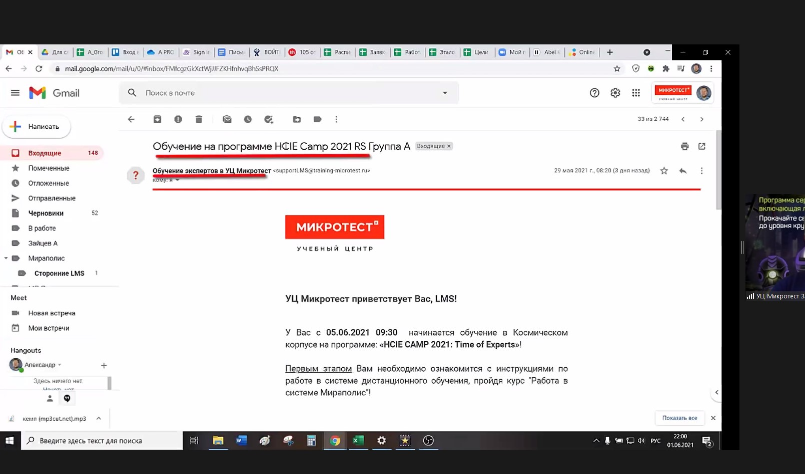
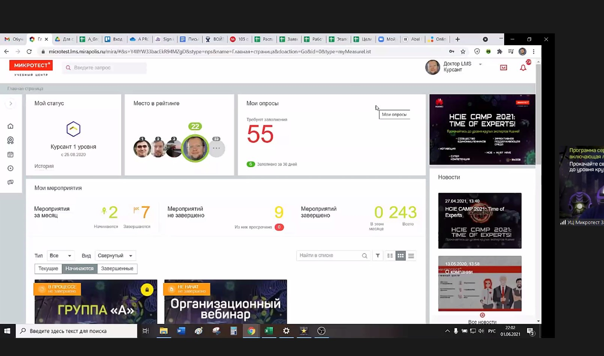
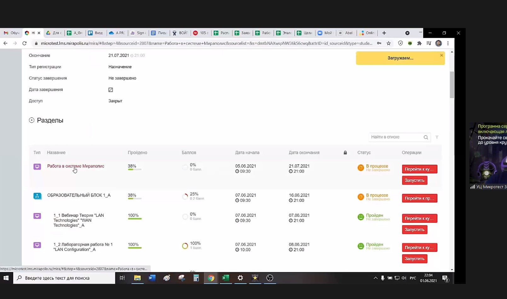
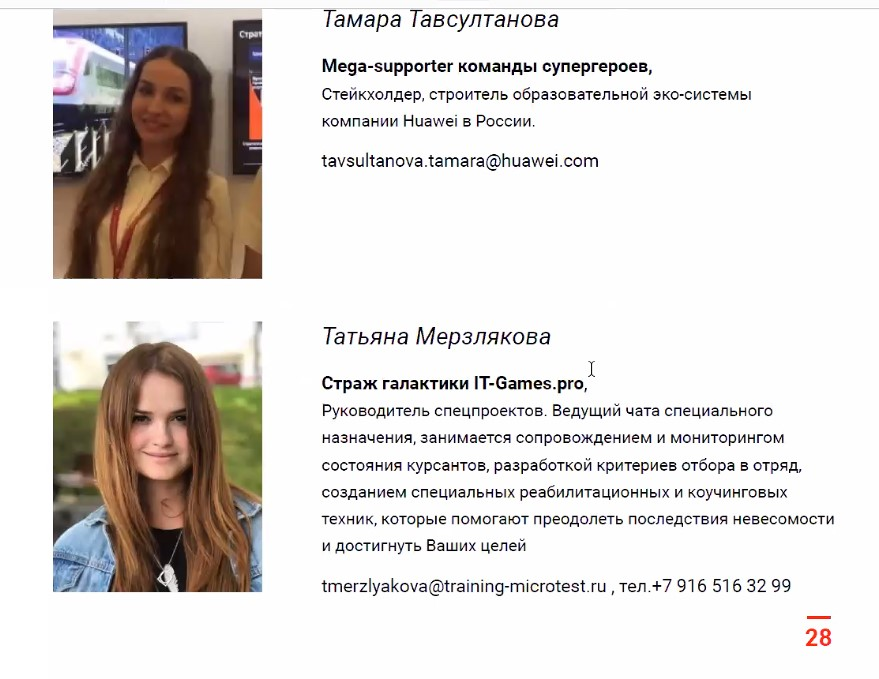
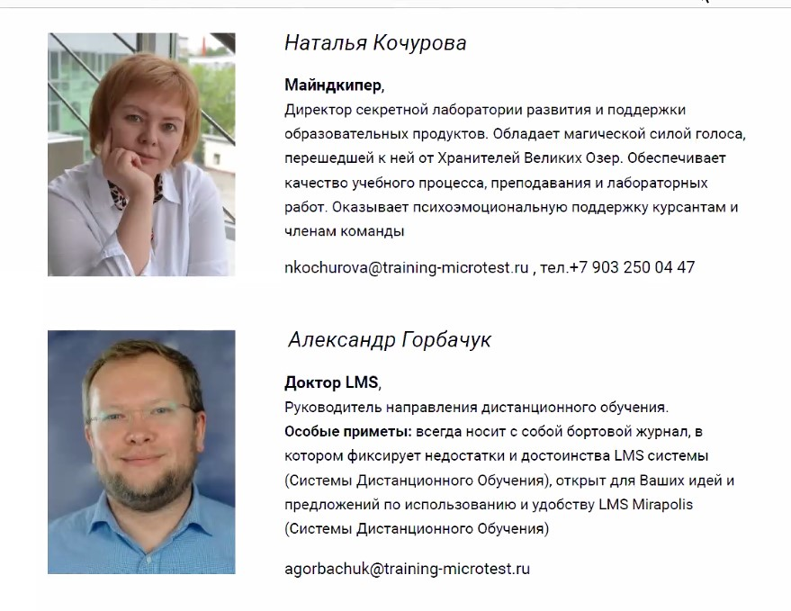
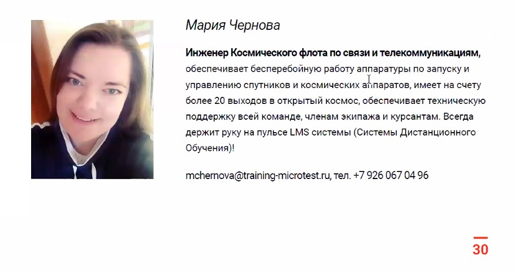
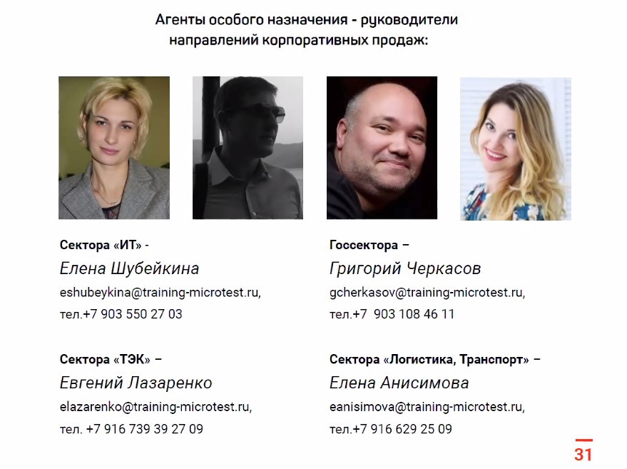
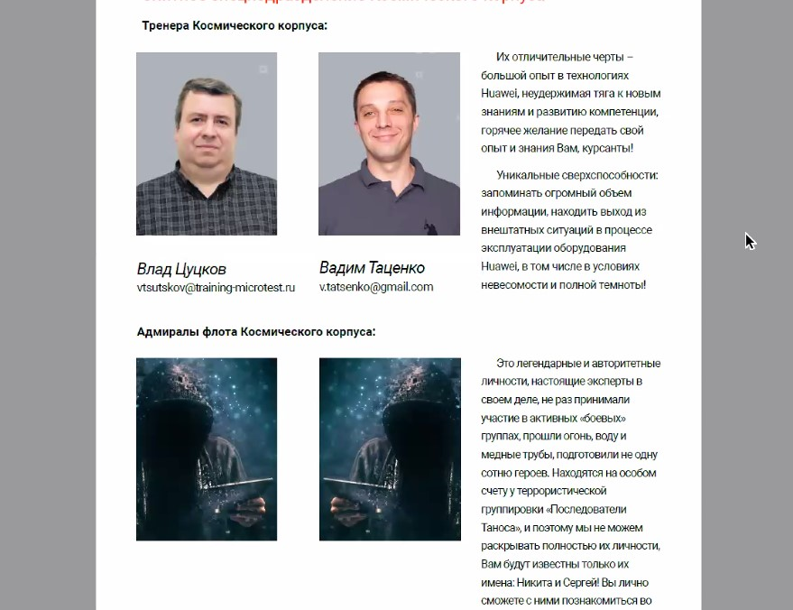

20210604

3 этиапа обучения HCIE ver.3, тестирование после каждого модуля, присутствуют факультативы (рекомендуется посещать), тренажеры по тестам:
- 1 этап - дистанционно, подготовка к письменному экзамену. 2 дня в неделю. 6 недель.

Теория - вебинарах
Лабораторки - Мираполис (лабгайд, ensp, туда же выкладывать конфиги)

Чаты:
- Zoom
- Telegram

Просмотреть видеоролики в ЛК.

В ЛК: ___Вебинары - 1 день, лабы - 2 дня, ДЗ - 7 дней, опросы 2 дня___

Материал к каждому занятию Просмотреть видеоролики в ЛК. После вебинара вечером загрузится запись вебинара

В 1-й лабе 2 видео: первое видео - введение.

Каждую неделю - опросы в другом окружении (не Мираполис).
По каждому блоку - промежуточное тестирование.

Кураторы:
Татьяне писать Для работодателя если понадобится писать письмо для работодателя.

Наталья - работа в уч. департаменте
Александр - 

Техподдержка - держать связь с ней по тех. вопросам

Продажники курсов

Тренера
Влад - тренер
Вадим - тренер

В конце - письменный экзамен

- 2 этап - очно, лабораторная работа - 8 часов. Удаленно сделать нельзя. 

3 этап  - интервью. Средняя цифра успешной сдачи - 65%. Вместо интервью - эссе, с проектированием структуры сети.

