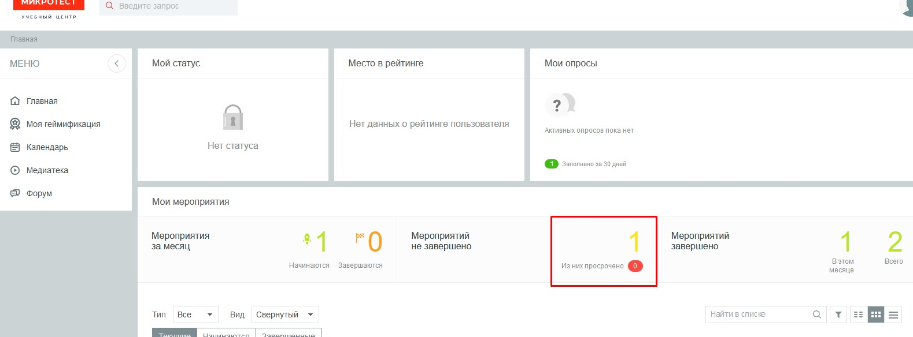
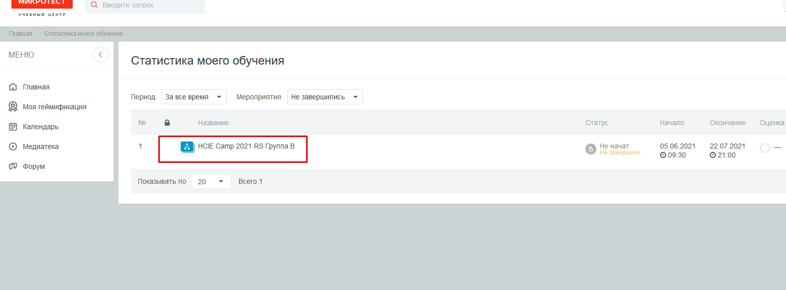
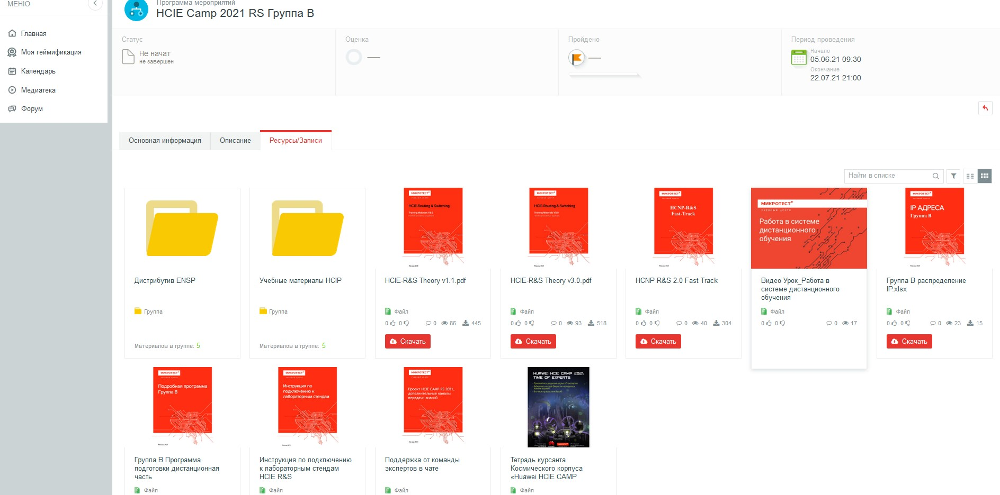
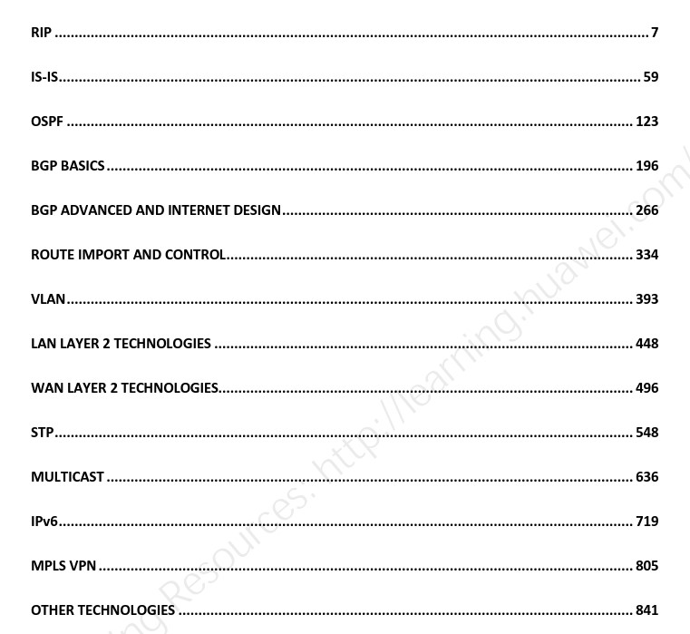
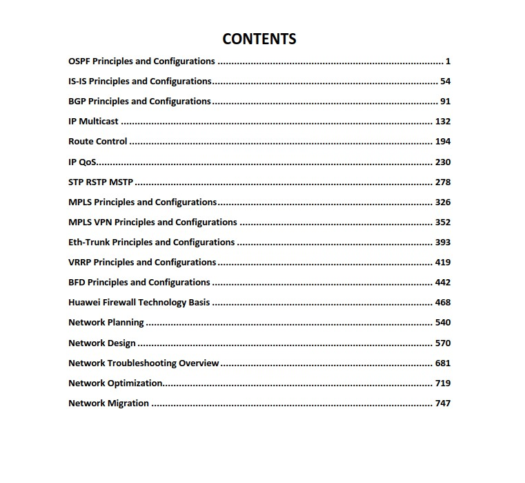
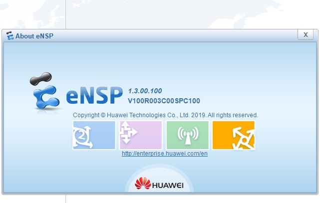
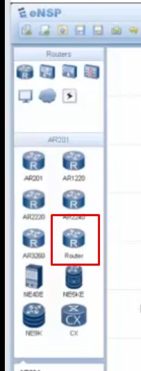

20210606

___Вопросы___
Папка с материалами ГруппыА:

- Не ясен порядок использования материалов. - Разбил материалы по версиям: v1.0 - теория, v3.0 - слайды и лабгайды
- почему есть версионность - вопрос снят

Папка с материалами HCIP:
- не ясен порядок использования материалов - вопрос снят

Лабораторные работы:
- Зачем сохранять конфиги во вкладку л/р Мираполиса, когда они на шаре - вопрос снят, лабы для отчета

Тестирование
- тест на English, похож на вопросы при приеме, есть ли вариант погонять тесты в обучающем режиме - да, все вопросы доступны в качалке

Обед с 13:00-14:00

Зашел в ЛК
Список материалов

Материалы скачиваю сюда:  E:\Study\HCIE\Course Materials
___HCIE-R&S Theory v1.1.pdf___ - слайды HCIE курса

___HCIE-R&S Theory v3.0.pdf___слайды HCIE курса, обновленная версия

___HCNP R&S 2.0 Fast Track___ - слайды HCNP, нужны так как в части материалов преподаватель ссылается на материал

___Группа B распределение IP.xlsx___ - мой адрес
- I раз -  172.16.30.76; PC-76

- II раз -  172.16.30.17; PC-17

___Группа В Программа подготовки дистанционная часть___ - программа, распечатал

___Инструкция по подключению к лабораторным стендам HCIE R&S___ - скачал

   - ___anyconnect-win-4.2.02075-web-deploy-k9.exe___ - скачал, установил. 
     - VPN 195.91.137.5, login/CampRS2021 - в инструкции. 
     - RDP на 172.16.30.76, login/pass - в инструкции - отключить звук

___Поддержка от команды экспертов в чате___ - очень полезно

Попасть на вебинар:
ЛК-> Мои мероприятия-> Банер "HCIE Camp 2021 RS Группа B"-> 
   - Ресурсы (все гайды)
   - Раскрыть вкладку РАЗДЕЛЫ
      - Выбрать и провалиться в нужный вебинар. Кнопки активируются по времени начала вебинара. Запись - на Вкладке вебинара-> Ресурсы/Записи

Как выполнить лабу
ЛК-> Мои мероприятия-> Банер "HCIE Camp 2021 RS Группа B"-> 
   -  Л/Р имеют время открытия/закрытия. На выполнения л/р - 2 дня
   - Вкладка описание с задачами л/р
   - Сама л/р ___C:\Users\Student\Desktop\Lab Topologies___
   - После завершения л/р выполнить сохранение лабы в каталог 172.16.30.100 (Z:\ANSWER LG and Homework\LAB_CONTROL\Group_B)
   - Не забыть отметить чекбоксами "Выполнил" результат выполнения л/р
   - И загрузить конфиги во вкладку данной л/р
   - Большая часть лаб сделана на GENERIC роутерах, но некоторые функции на этом R отсутствуют

   - Делать периодический Save в консоли
   - Наиболее важные лабы:
      - 08, 09, 10, 16, 17 ___наизусть___, с пониманием всего, что делаем. 
      - Чуть менее важные - все остальные
      - не будет IPSEC, MC    

Как пройти опрос   
ЛК-> Мои мероприятия-> Банер "HCIE Camp 2021 RS Группа B"-> 
   - на опрос 2 дня
   - не забыть нажать кнопку ОТПРАВИТЬ

Как выполнить тест
ЛК-> Мои мероприятия-> Банер "HCIE Camp 2021 RS Группа B"-> 
   - каждый чтв или пятницу, 2 дня
   - проходной балл 75%
   - тест на English, похож на вопросы при приеме

Как выполнить ДЗ
ЛК-> Мои мероприятия-> Банер "HCIE Camp 2021 RS Группа B"-> 
   - каждый чтв или пятницу, 7 дей
   - По выполнению - чекбокс ВЫПОЛНИЛ и выгрузить ДЗ
   - Проверка ДЗ не сразу, оченка - не сразу.

Как выполнить геймификацию
ЛК-> Мои мероприятия-> Банер "HCIE Camp 2021 RS Группа B"-> 
   - рассказали как начисляются монеты за участие в лабах/вебинарах/ДЗ...

Статусы мероприятий 
ЛК-> Мои мероприятия-> Банер "HCIE Camp 2021 RS Группа B"-> 
   - Есть мероприятия закрываются при открытии/закрытии браузера. Быть аккуратным, после сверки

